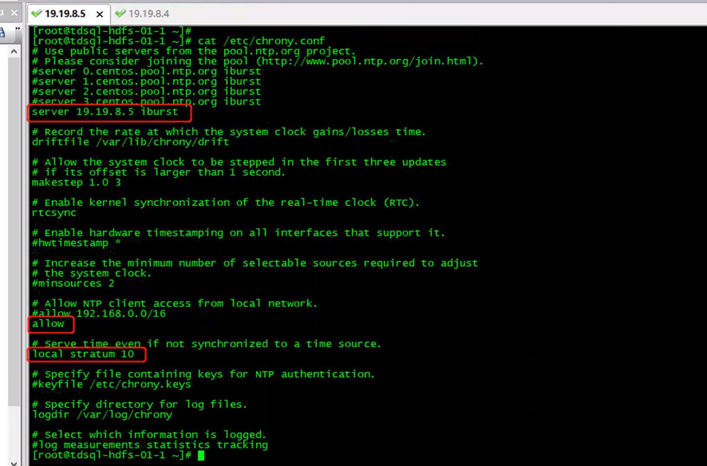

# 1.服务端配置
```sh
yum install -y chrony
cat /etc/chrony.conf
```

```sh
date
systemctl start chronyd
systemctl enable chronyd
date
chronyc sources -v
```

# 2.客户端配置
```sh
yum install -y chrony
vi /etc/chrony.conf 
 server 172.20.12.11 iburst
```

```sh
date
systemctl start chronyd
systemctl enable chronyd
date
chronyc sources -v
```