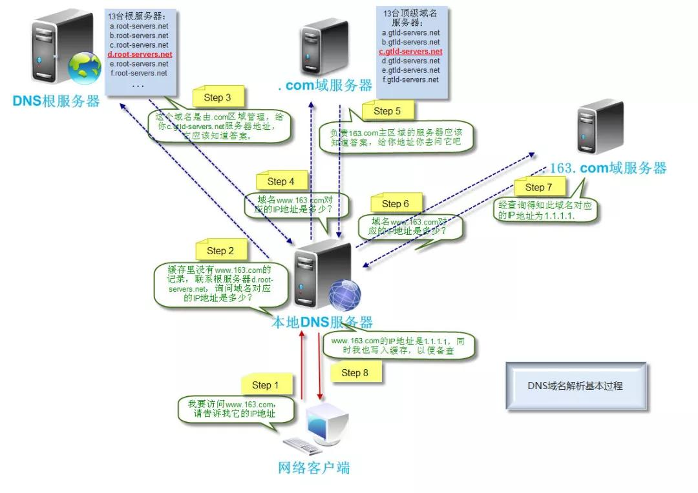
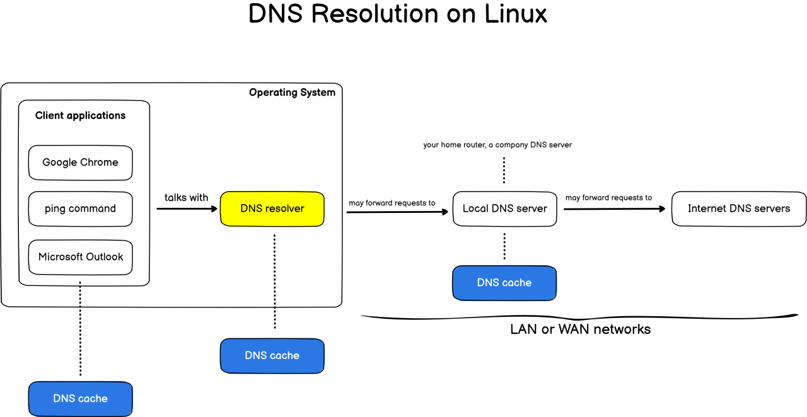

 

- [主要概念](#主要概念)
- [DNS 访问流程](#dns-访问流程)
- [例子](#例子)
- [常见记录](#常见记录)
  - [A记录](#a记录)
  - [CNAME记录](#cname记录)
  - [NS 记录](#ns-记录)
  - [MX记录](#mx记录)
- [常见工具DNS缓存时间](#常见工具dns缓存时间)
  - [一些浏览器的DNS缓存时间:](#一些浏览器的dns缓存时间)
  - [IOS](#ios)
- [DNS在linux上解析](#dns在linux上解析)
  - [常见操作](#常见操作)
    - [查看dns缓存](#查看dns缓存)
    - [清除dns缓存](#清除dns缓存)
    - [查看DNS解析器](#查看dns解析器)
    - [使用systemd-resolved刷新DNS](#使用systemd-resolved刷新dns)
    - [验证DNS缓存是否被刷新](#验证dns缓存是否被刷新)
    - [调整A记录的TTL](#调整a记录的ttl)
    - [dig](#dig)

# 主要概念
主机名  
次级域名  
顶级域名  
根域名

# DNS 访问流程
访问www.baidu.com.root为例，看下是DNS会进行哪些操作：

1. 首先查找电脑上的DNS缓存列表，如果有记录，那么直接返回对于IP地址，否则进行下一步；
2. 查找电脑上的HOST文件的映射关系，如果有记录，那么返回对于IP地址，否则进行下一步；
3. 查找互联网线路供应商的本地DNS服务器（即中国电信、中国移动或中国联通），本地DNS服务器先查找自己的缓存记录，如果有记录，那么返回对应IP地址，否则本地DNS服务器向根域名服务器发生请求；
4. 根域名服务器收到请求后，查看是.com顶级域名，于是返回.com顶级域名服务器的IP地址给到本地DNS服务器；
5. 本地DNS服务器收到回复后，向.com顶级域名服务器发起请求；
6. .com顶级域名服务器收到请求后，查看是.http://baidu.com次级域名，于是返回.http://baidu.com次级域名服务器的IP地址给到DNS服务器；
7. 本地DNS服务器收到回复后，向.http://baidu.com次级域名服务器发起请求；
8. .http://baidu.com次级域名服务器收到请求后，查看是自己管理的域名，于是查看域名和IP地址映射表，把http://www.baidu.com的IP地址返回给本地DNS服务器；
9. 本地DNS服务器收到回复后，向电脑回复域名对应IP地址，并把记录写入本地DNS服务器的缓存里；
10. 电脑收到回复后，使用IP地址访问网站，并把记录写入电脑DNS缓存中。

# 例子
访问http://www.163.com为例，看下是DNS会进行哪些操作： 


# 常见记录
## A记录
A记录是用来指定主机名（或域名）对应的IP地址记录。用户可以将该域名下的网站服务器指向到自己的web server上。同时也可以设置您域名的二级域名。
```sh
// 定义www.example.com的ip地址
www.example.com.     IN     A     139.18.28.5;
```
上面的就是一条 DNS 记录，纯文本即可。IN 代表记录用于互联网，是 Intenet 的缩写。在历史上 Internet 起源于阿帕网，在同时代有很多竞争的网络，IN 这个描述也就保留了下来。

www.example.com 是要解析的域名。A 是记录的类型，A 记录代表着这是一条用于解析 IPv4 地址的记录。从这条记录可知，www.example.com的 IP 地址是 139.18.28.5。;是语句块的结尾，也是注释。

## CNAME记录
CNAME记录，即：别名记录。这种记录允许您将多个名字映射到同一台计算机。 通常用于同时提供WWW和MAIL服务的计算机。例如，有一台计算机名为“host.mydomain.com”（A记录）。 它同时提供WWW和MAIL服务，为了便于用户访问服务。可以为该计算机设置两个别名（CNAME）：WWW和MAIL。
```sh
// 定义www.example.com的别名
a.example.com.          IN     CNAME   b.example.com.
```
这条 DNS 记录定义了 a.example.com 是 b.example.com 的别名。用户在浏览器中输入 a.example.com 时候，通过 DNS 查询会知道 a.example.com 是 b.example.com 的别名，因此需要实际 IP 的时候，会去拿 b.example.com 的 A 记录

## NS 记录
NS（Name Server）记录是描述 DNS 服务器网址。从 DNS 的存储结构上说，Name Server 中含有权威 DNS 服务的目录。也就是说，NS 记录指定哪台 Server 是回答 DNS 查询的权威域名服务器。

## MX记录
MX记录邮件路由记录，用户可以将该域名下的邮件服务器指向到自己的mail server上，然后即可自行操控所有的邮箱设置。您只需在线填写您服务器的IP地址，即可将您域名下的邮件全部转到您自己设定相应的邮件服务器上。  

当一个 DNS 查询看到 NS 记录的时候，会再去 NS 记录配置的 DNS 服务器查询，得到最终的记录。如下面这个例子：
```
a.com.     IN      NS      ns1.a.com.
a.com.     IN      NS      ns2.a.com.
```
当解析 a.com 地址时，我们看到 a.com 有两个 NS 记录，所以确定最终 a.com 的记录在 ns1.a.com 和 ns2.a.com 上。从设计上看，ns1 和 ns2 是网站 a.com 提供的智能 DNS 服务器，可以提供负载均衡、分布式 Sharding 等服务。比如当一个北京的用户想要访问 a.com 的时候，ns1 看到这是一个北京的 IP 就返回一个离北京最近的机房 IP。

上面代码中 a.com 配置了两个 NS 记录。通常 NS 不会只有一个，这是为了保证高可用，一个挂了另一个还能继续服务。通常数字小的 NS 记录优先级更高，也就是 ns1 会优先于 ns2 响应。配置了上面的 NS 记录后，如果还配置了 a.com 的 A 记录，那么这个 A 记录会被 NS 记录覆盖。

# 常见工具DNS缓存时间
## 一些浏览器的DNS缓存时间:
1. Chrome  
为了加快访问速度，Google Chrome浏览器采用了预提DNS记录，在本地建立DNS缓存的方法，加快网站的连接速度。  
chrome://net-internals/#dns   
这里可以看各域名的DNS 缓存时间。Chrome对每个域名会默认缓存60s。  
2. IE  
　　IE将DNS缓存30min。  
3. Firefox  
　　Firefox有DNS缓存功能，但是默认缓存时间只有1分钟，可以通过修改该默认值加快DNS解析速度

## IOS
按照官方文档说法，iOS设备上每24小时刷新一次DNS缓存

# DNS在linux上解析

## 常见操作

### 查看dns缓存
```
cat /etc/resolv.conf
```

### 清除dns缓存
```
#yum -y install nscd
nscd -i hosts
```

### 查看DNS解析器
在大多数Linux系统上，DNS解析器是“ systemd-resolved ”或dnsmasq。为了知道您是否正在处理一个或另一个，您可以执行以下命令
```
$ sudo lsof -i :53 -S
COMMAND   PID            USER   FD   TYPE DEVICE SIZE/OFF NODE NAME
systemd-r 721 systemd-resolve   13u  IPv4  20210      0t0  UDP localhost:domain 
systemd-r 721 systemd-resolve   14u  IPv4  20211      0t0  TCP localhost:domain (LISTEN)
```

### 使用systemd-resolved刷新DNS
如果使用的是systemd-resolved，则在Linux上刷新DNS的最简单方法是使用“ systemd-resolve”命令，后跟“ -flush-caches”。
或者，您可以使用“ resolvectl”命令，然后使用“ flush-caches”选项。
```
$ sudo systemd-resolve --flush-caches
$ sudo resolvectl flush-caches
```
### 验证DNS缓存是否被刷新
```
$ sudo systemd-resolve --statistics

或者
# resolvectl statistics
DNSSEC supported by current servers: no

Transactions              
Current Transactions: 0
  Total Transactions: 1369
                          
Cache                     
  Current Cache Size: 7
          Cache Hits: 573
        Cache Misses: 798
                          
DNSSEC Verdicts           
              Secure: 0
            Insecure: 0
               Bogus: 0
       Indeterminate: 0
```

### 调整A记录的TTL
```
mail2  86400  IN  A     192.0.2.4             ; IPv4 address for mail2.example.com
```

### dig
dig（domain information groper）是域名查询工具

查询对应域名的 IP
```
# dig google.com

; <<>> DiG 9.18.1-1ubuntu1.2-Ubuntu <<>> google.com
;; global options: +cmd
;; Got answer:
;; ->>HEADER<<- opcode: QUERY, status: NOERROR, id: 25006
;; flags: qr rd ra; QUERY: 1, ANSWER: 1, AUTHORITY: 0, ADDITIONAL: 1

;; OPT PSEUDOSECTION:
; EDNS: version: 0, flags:; udp: 65494
;; QUESTION SECTION:
;google.com.                    IN      A

;; ANSWER SECTION:
google.com.             242     IN      A       142.251.220.46

;; Query time: 0 msec
;; SERVER: 127.0.0.53#53(127.0.0.53) (UDP)
;; WHEN: Mon Apr 03 17:37:09 CST 2023
;; MSG SIZE  rcvd: 55
```
跟踪 dig 查询的路径
```
# dig www.baidu.com +trace

; <<>> DiG 9.18.1-1ubuntu1.2-Ubuntu <<>> www.baidu.com +trace
;; global options: +cmd
.                       77019   IN      NS      l.root-servers.net.
.                       77019   IN      NS      h.root-servers.net.
.                       77019   IN      NS      b.root-servers.net.
.                       77019   IN      NS      k.root-servers.net.
.                       77019   IN      NS      m.root-servers.net.
.                       77019   IN      NS      c.root-servers.net.
.                       77019   IN      NS      a.root-servers.net.
.                       77019   IN      NS      f.root-servers.net.
.                       77019   IN      NS      j.root-servers.net.
.                       77019   IN      NS      d.root-servers.net.
.                       77019   IN      NS      i.root-servers.net.
.                       77019   IN      NS      g.root-servers.net.
.                       77019   IN      NS      e.root-servers.net.
;; Received 239 bytes from 127.0.0.53#53(127.0.0.53) in 0 ms

com.                    172800  IN      NS      e.gtld-servers.net.
com.                    172800  IN      NS      b.gtld-servers.net.
com.                    172800  IN      NS      a.gtld-servers.net.
com.                    172800  IN      NS      d.gtld-servers.net.
com.                    172800  IN      NS      i.gtld-servers.net.
com.                    172800  IN      NS      f.gtld-servers.net.
com.                    172800  IN      NS      j.gtld-servers.net.
com.                    172800  IN      NS      k.gtld-servers.net.
com.                    172800  IN      NS      c.gtld-servers.net.
com.                    172800  IN      NS      g.gtld-servers.net.
com.                    172800  IN      NS      h.gtld-servers.net.
com.                    172800  IN      NS      l.gtld-servers.net.
com.                    172800  IN      NS      m.gtld-servers.net.
com.                    86400   IN      DS      30909 8 2 E2D3C916F6DEEAC73294E8268FB5885044A833FC5459588F4A9184CF C41A5766
com.                    86400   IN      RRSIG   DS 8 1 86400 20230416050000 20230403040000 60955 . SRaXauZ48jcmDpP27/RG3ihQDatUnsASr/727qW7WKZmrfRzdcXO/4n5 O9Go+HBUxi41eL4mnX4IwDpNTJh9JqNdND+ndJ1ZQE4i8GHjTQUkvw8U IYSP0j6uNSbLU/vNmW8DDztxI5N0ynJ2TiFan8pIWGRv/nUGe36cwQxf Dv3/JnAGKXXSZrYzHxVe/rTewbOPfj2k/W4EsdqnOyjExXey7XcaU1FP Og5EahnAmrJVhAuM2EXifh8rKOZK3mol05upfHobC71GhKKpI2XhPNT3 wXTqUTfLOwt6ajIbbBRyWFBw8hYnrrEmxvv4D8oaoqVluCT0H/CwMhyk jgqxRA==
;; Received 1173 bytes from 192.203.230.10#53(e.root-servers.net) in 0 ms

```
DNS反向解析
```
我们一般所说的DNS域名解析指的是正向解析即从域名解析到相应的IP,反之从IP解析到对应的DNS服务器就是反向解析，8.8.8.8是google的一个公共DNS服务器，我们可以通过dig -x查找该ip对应的DNS服务器

$ dig -x 8.8.8.8 +short    
google-public-dns-a.google.com.
```