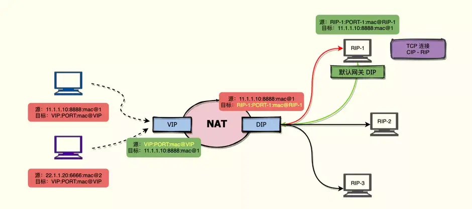
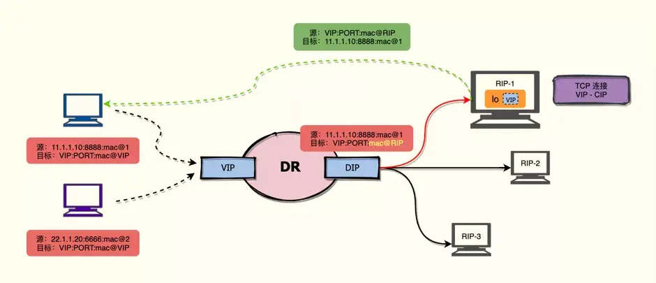
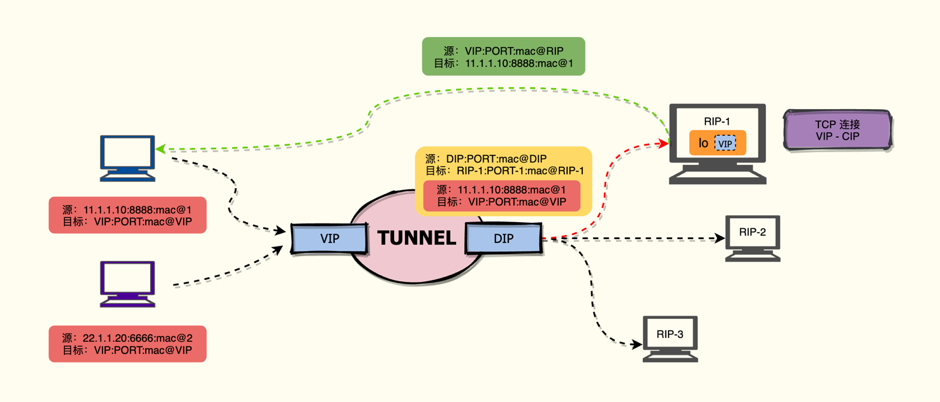

- [基本概念](#基本概念)
- [模式](#模式)
  - [NAT 模式](#nat-模式)
  - [DR 模式](#dr-模式)
  - [TUN 模式](#tun-模式)
    - [配置RS机器](#配置rs机器)
    - [配置DIP机器](#配置dip机器)
      - [参数调优](#参数调优)
    - [测试VIP](#测试vip)
    - [注意点](#注意点)
    - [keepalive 配置](#keepalive-配置)
    - [keepalive 操作](#keepalive-操作)
    - [es 健康检测脚本](#es-健康检测脚本)
    - [抓包分析](#抓包分析)
- [网卡中断平衡](#网卡中断平衡)
- [Q \& A](#q--a)
  - [为什么 LVS的机器要在同个子网(vrrp)](#为什么-lvs的机器要在同个子网vrrp)

# 基本概念

数据包的发送链路为：CIP ➡ VIP ➡ DIP ➡ RIP，即 客户端 IP ➡ 虚拟 IP ➡ 分发 IP ➡ 真实服务器 IP

# 模式

红色表示发出的数据包，绿色表示返回的数据包，黄色表示负载均衡器修改的内容 ，虚线表示经过 N 个下一跳，即可以不在同一局域网内，实线表示只能 “跳跃一次”，即必须在同一局域网内。

## NAT 模式



- NAT 模式修改数据包的「目标 IP 地址」或 「源 IP 地址」，所有的请求数据包、响应数据包都要经过负载均衡器，所以 NAT 模式支持对端口的转换
- 真实服务器的默认网关是负载均衡器，所以真实服务器和负载均衡器必须在同一个网段

## DR 模式



- DR 模式仅修改数据包的「目标 MAC 地址」，只有请求数据包需要经过负载均衡器，所以 DR 模式不支持对端口的转换
- 真实服务器和负载均衡器必须在同一个网段，且真实服务器的默认网关不能是负载均衡器
- 真实服务器的 lo 接口上需要配置 VIP 的 IP 地址，且真实服务器需要更改 ARP 协议，“隐藏” lo 接口上的 VIP

## TUN 模式



- TUNNEL 模式不改变原数据包，而是在原数据包上新增一层 IP 首部信息。所以 TUNNEl 模式不支持对端口的转换，且真实服务器必须能够支持解析两层 IP 首部信息
- 真实服务器和负载均衡器可以不在同一个网段中
- 真实服务器需要更改 ARP 协议，“隐藏” lo 接口上的 VIP

### 配置RS机器

```sh
#RS
#安装 ipip 模块
#验证 ipip 模块是否加载成功

$ modprobe ipip
$ lsmod | grep ipip
ipip                   16384  0 
tunnel4                16384  1 ipip
ip_tunnel              24576  1 ipip


```

```sh
#修改 ARP 协议
#默认都是0
echo 1 > /proc/sys/net/ipv4/conf/tunl0/arp_ignore # 忽略来自tunl0接口的ARP请求
echo 2 > /proc/sys/net/ipv4/conf/tunl0/arp_announce # 在回应ARP请求时，使用tunl0接口的IP地址作为源IP地址
echo 1 > /proc/sys/net/ipv4/conf/all/arp_ignore # 忽略来自所有接口（包括虚拟接口和物理接口）的ARP请求
echo 2 > /proc/sys/net/ipv4/conf/all/arp_announce # 回应ARP请求时，使用接口的IP地址作为源IP地址
```

```sh
#rp_filter 表示是否开启对数据包源地址的校验，这里我们直接关闭校验即可。
#默认都是1
echo 0 > /proc/sys/net/ipv4/conf/tunl0/rp_filter
echo 0 > /proc/sys/net/ipv4/conf/all/rp_filter
```

上面两部可以持久化配置

```sh
echo -e "
#BEGIN LVS SET
net.ipv4.conf.tunl0.arp_ignore = 1
net.ipv4.conf.tunl0.arp_announce = 2
net.ipv4.conf.all.arp_ignore = 1
net.ipv4.conf.all.arp_announce = 2
net.ipv4.conf.tunl0.rp_filter = 0
net.ipv4.conf.all.rp_filter = 0
#END LVS SET
" >> /etc/sysctl.conf
sysctl -p
```

```sh
ifconfig tunl0 172.1.1.114 broadcast 172.1.1.114 netmask 255.255.255.255 up
route add -host 172.1.1.114 tunl0
#验证配置
$ifconfig
eth0: flags=4163<UP,BROADCAST,RUNNING,MULTICAST>  mtu 1500
        inet 172.1.1.56  netmask 255.255.255.0  broadcast 172.1.1.255
        inet6 fe80::f816:3eff:fece:361f  prefixlen 64  scopeid 0x20<link>
        ether fa:16:3e:ce:36:1f  txqueuelen 1000  (Ethernet)
        ……

lo: flags=73<UP,LOOPBACK,RUNNING>  mtu 65536
        ……

tunl0: flags=193<UP,RUNNING,NOARP>  mtu 1480
        inet 172.1.1.114  netmask 255.255.255.255
        tunnel   txqueuelen 1000  (IPIP Tunnel)
        RX packets 0  bytes 0 (0.0 B)
        RX errors 0  dropped 0  overruns 0  frame 0
        TX packets 0  bytes 0 (0.0 B)
        TX errors 0  dropped 0 overruns 0  carrier 0  collisions 0

$route -n
Kernel IP routing table
Destination     Gateway         Genmask         Flags Metric Ref    Use Iface
0.0.0.0         172.1.1.254  0.0.0.0         UG    0      0        0 eth0
169.254.0.0     0.0.0.0         255.255.0.0     U     1002   0        0 eth0
169.254.169.254 172.1.1.1    255.255.255.255 UGH   0      0        0 eth0
172.1.1.114  0.0.0.0         255.255.255.255 UH    0      0        0 tunl0
172.1.1.0    0.0.0.0         255.255.255.0   U     0      0        0 eth0
```

### 配置DIP机器

```sh
yum install -y ipvsadm keepalived

echo 1 > /proc/sys/net/ipv4/ip_forward
#配置路由入口规则
ipvsadm -A -t 172.1.1.114:9200 -s wrr
#配置路由出口规则，由于在不同的网段，这里需要配置 RS 的外网地址
ipvsadm -a -t 172.1.1.114:9200 -r 172.1.1.56 -i -w 1
ipvsadm -a -t 172.1.1.114:9200 -r 172.1.1.55 -i -w 1
ipvsadm -a -t 172.1.1.114:9200 -r 172.1.1.54 -i -w 1
#配置 DIP
#安装 ipip 模块
modprobe ipip
ifconfig tunl0 172.1.1.114 broadcast 172.1.1.114 netmask 255.255.255.255 up
# 如果不是隧道模式，建议执行  arping -c 3 -A -I eth0 172.1.1.114  这里我们使用的是隧道模式，所以不需要执行arping
route add -host 172.1.1.114 tunl0
#验证配置
ipvsadm -ln
```

#### 参数调优

OS参数调优

```sh
# 关闭透明大页
test -e /sys/kernel/mm/transparent_hugepage/enabled && cat /sys/kernel/mm/transparent_hugepage/enabled | grep never && echo never > /sys/kernel/mm/transparent_hugepage/enabled && (grep '# ES TRANSPARENT_HUGEPAGE SET' /etc/rc.local || echo 'echo never > /sys/kernel/mm/transparent_hugepage/enabled # ES TRANSPARENT_HUGEPAGE SET' >> /etc/rc.local)

echo 6553500 > /proc/sys/fs/file-max
# grep "file-max" /etc/sysctl.conf || echo "fs.file-max=6553500" >> /etc/sysctl.conf
# grep "max_map_count" /etc/sysctl.conf || echo "vm.max_map_count=655360" >> /etc/sysctl.conf
echo -e "
#BEGIN LVS SET
vm.max_map_count=655360
fs.file-max=6553500
kernel.core_pattern=/data/coredump/core-%e-%p-%t
net.ipv4.ip_local_port_range=32768 61000
kernel.pid_max=98304
kernel.threads-max=8241675
net.ipv4.tcp_tw_reuse=1
net.ipv4.tcp_window_scaling=1
net.ipv4.tcp_max_syn_backlog=4096
net.core.somaxconn=4096
net.core.netdev_max_backlog=2000
vm.swappiness=0
net.ipv4.tcp_keepalive_time=5
net.ipv4.tcp_keepalive_intvl=2
net.ipv4.tcp_keepalive_probes=5
net.ipv4.tcp_retries2=6

net.ipv4.ip_forward=1
#END LVS SET
" >> /etc/sysctl.conf


test -f /proc/sys/fs/nr_open && nr_open=`cat /proc/sys/fs/nr_open` && echo $nr_open | grep -E "[0-9]+" && [ $nr_open -lt 1000000 ] && echo '1048576' > /proc/sys/fs/nr_open
test -e /etc/security/limits.conf && (grep '# BEGIN ES SET' /etc/security/limits.conf || echo -e "
# BEGIN LVS SET
* hard nofile 65536
* soft nofile 65536
*       hard    memlock    unlimited
*       soft    memlock    unlimited
*          -    nofile     1000000
# END LVS SET
" >> /etc/security/limits.conf )


test -e /etc/security/limits.d/80-nofile.conf && (grep '# BEGIN LVS SET' /etc/security/limits.d/80-nofile.conf || echo -e "
# BEGIN LVS SET
*          -    nofile     1000000
# END LVS SET
" >> /etc/security/limits.d/80-nofile.conf )

#内核参数CONFIG_IP_VS_TAB_BITS 参数优化
echo -e "
options ip_vs conn_tab_bits=20
" >> /etc/modprobe.d/ip_vs.conf

modprobe -r ip_vs
modprobe ip_vs

sudo sysctl -p
```

lvs参数调优

```sh
#--set tcp tcpfin udp 设置连接超时值
# tcp:tcp空闲释放时间  tcpfin:如果客户端发起了FIN断连,服务端等待断离连时间  udp:udp空闲释放时间 
#查看默认配置
$ ipvsadm -Ln --timeout
Timeout (tcp tcpfin udp): 900 120 300

#查看当前连接的状态
$ ipvsadm -Lnc
IPVS connection entries
pro expire state       source             virtual            destination
TCP 01:57  FIN_WAIT    172.1.1.109:39302 172.1.1.114:9200 172.1.1.56:9200

#需要根据具体业务场景设置
ipvsadm --set 900 120 300

```

### 测试VIP

```sh
#在client机器上
route add -host 172.1.1.114 gw 172.1.1.108
curl -XGET 'http://172.1.1.114:9200/_cluster/health?pretty' -uelastic:elastic
```

### 注意点

openstack 的虚拟机上，Neutron默认会在安全组规则中添加一条防火墙策略检测TCP连接状态，经过状态检测后认为连接是无效状态的，就会将包丢弃，导致无法正常通信，因此需要修改Neutron代码使其不添加相关防火墙策略，并更新所有节点节点的Neutron服务

```sh
#注释
sed -i 's/ self._setup_spoof_filter_chain/ #self._setup_spoof_filter_chain/g' /usr/lib/python2.7/site-packages/neutron/agent/linux/iptables_firewall.py
sed -i 's/ mac_ipv4_pairs, ipv4_rules/ #mac_ipv4_pairs, ipv4_rules/g' /usr/lib/python2.7/site-packages/neutron/agent/linux/iptables_firewall.py
sed -i 's/ mac_ipv6_pairs, ipv6_rules/ #mac_ipv6_pairs, ipv6_rules/g' /usr/lib/python2.7/site-packages/neutron/agent/linux/iptables_firewall.py
sed -i 's/ self._drop_invalid_packets/ #self._drop_invalid_packets/g' /usr/lib/python2.7/site-packages/neutron/agent/linux/iptables_firewall.py

#查看是否注释
grep -rn "self._setup_spoof_filter_chain" /usr/lib/python2.7/site-packages/neutron/agent/linux/iptables_firewall.py
grep -rn "mac_ipv4_pairs, ipv4_rules" /usr/lib/python2.7/site-packages/neutron/agent/linux/iptables_firewall.py
grep -rn "mac_ipv6_pairs, ipv6_rules" /usr/lib/python2.7/site-packages/neutron/agent/linux/iptables_firewall.py
grep -rn "self._drop_invalid_packets" /usr/lib/python2.7/site-packages/neutron/agent/linux/iptables_firewall.py

##重启服务
systemctl status neutron-openvswitch-agent.service
```

modprobe -r ip_vs 执行失败

```sh
#如果上面的命令失败
$ lsmod|more
Module                  Size  Used by
ip_vs_wrr              16384  1 
ip_vs                 155648  3 ip_vs_wrr
nf_conntrack          147456  1 ip_vs
nf_defrag_ipv6         24576  2 nf_conntrack,ip_vs
nf_defrag_ipv4         16384  1 nf_conntrack
……
#模块名称   模块大小  该模块调用其他模块的次数  该模块被什么模块调用
#然后执行
modprobe -r ip_vs_wrr
modprobe -r ip_vs
modprobe ip_vs

#验证是否生效
$ ipvsadm -Ln
IP Virtual Server version 1.2.1 (size=1048576)  #默认是4096
Prot LocalAddress:Port Scheduler Flags
  -> RemoteAddress:Port           Forward Weight ActiveConn InActConn
TCP  172.1.1.114:9200 wrr
  -> 172.1.1.56:9200           Tunnel  1      0          0  
```

### keepalive 配置

```json
global_defs {
   router_id LVS_TEST
   script_user root
}

vrrp_instance VI_1 {
    state MASTER
    interface eth0
    virtual_router_id 114
    priority 100
    advert_int 1
    authentication {
        auth_type PASS
        auth_pass 1111
    }
    virtual_ipaddress {
        172.1.1.114 dev tunl0
    }
}

virtual_server 172.1.1.114 9200 {
    #健康时间检查，单位秒
    delay_loop 3
    #负载均衡调度算法wlc|rr，和您将使用的LVS的调度算法保持原则一致
    lb_algo wrr
    #负载均衡转发规则 DR NAT TUN。和您将启动的LVS的工作模式设置一致
    lb_kind TUN
    #会话保持时间，因为我们经常使用的是无状态的集群架构，所以这个设置可有可无
    persistence_timeout 10
    #转发协议，当然是TCP
    protocol TCP
    #真实的下层ES管理节点的健康监测
    real_server 172.1.1.54 9200 {
        #节点权重
        weight 10
        #设置检查方式，可以设置HTTP_GET | SSL_GET|TCP_CHECK
        MISC_CHECK {            #0 检测成功, 1 检测失败，将从服务器池中移除
            misc_path "/data/es_check.sh 172.1.1.54 9200" #脚本名，需全路径
                        misc_timeout 3             #脚本执行的超时时间
                        misc_dynamic                #动态调整服务器权重 
        }
    }
    real_server 172.1.1.55 9200 {
        #节点权重
        weight 10
        #设置检查方式，可以设置HTTP_GET | SSL_GET|TCP_CHECK
        MISC_CHECK {            #0 检测成功, 1 检测失败，将从服务器池中移除
            misc_path "/data/es_check.sh 172.1.1.55 9200" #脚本名，需全路径
                        misc_timeout 3             #脚本执行的超时时间
                        misc_dynamic                #动态调整服务器权重 
        }
    }
    real_server 172.1.1.56 9200 {
        #节点权重
        weight 10
        #设置检查方式，可以设置HTTP_GET | SSL_GET|TCP_CHECK
        MISC_CHECK {            #0 检测成功, 1 检测失败，将从服务器池中移除
            misc_path "/data/es_check.sh 172.1.1.56 9200" #脚本名，需全路径
                        misc_timeout 3             #脚本执行的超时时间
                        misc_dynamic                #动态调整服务器权重 
        }
    }
}
```

### keepalive 操作

```sh
#查看日志
journalctl -f -u keepalived
#重启
systemctl restart keepalived
```

### es 健康检测脚本

```sh
$ cat /data/es_check.sh 
#!/bin/bash
ip=$1
port=$2
health=`curl -XGET "http://${ip}:${port}/_cluster/health?pretty" -uelastic:elastic -s | grep cluster_name | wc -l`
if [ ${health} -eq 1 ]
then
    exit 0
else 
    exit 1
fi
```

### 抓包分析

```sh
tcpdump -e -nn 'port 9200' -i any
tcpdump -e -nn 'port 9200' -i any -A #打印包的ASCII值
```

# 网卡中断平衡

[网卡中断](network/网卡中断.md)

# Q & A

## 为什么 LVS的机器要在同个子网(vrrp)

LVS是一个负载均衡器，其主要工作原理是将来自客户端的请求分发到多个后端服务器上，以提高系统的性能和可靠性。为了实现这个目的，LVS通常使用虚拟路由器冗余协议（VRRP）来实现高可用性。

在VRRP中，LVS服务器集群中的多个节点（通常是主节点和备用节点）会共享一个虚拟IP地址，并使用VRRP协议来协调节点之间的通信，确保当主节点出现故障时，备用节点可以接管虚拟IP地址并继续为客户端提供服务。

为了确保VRRP的正常工作，LVS服务器集群中的所有节点必须位于同一子网中。这是因为VRRP使用多播消息来协调节点之间的通信，而多播消息只能在同一子网内传递。

如果LVS服务器集群中的节点不在同一子网中，则VRRP无法正常工作，节点之间无法协调，也就无法实现高可用性。因此，为了确保LVS服务器集群的正常运行，所有节点必须位于同一子网中。
