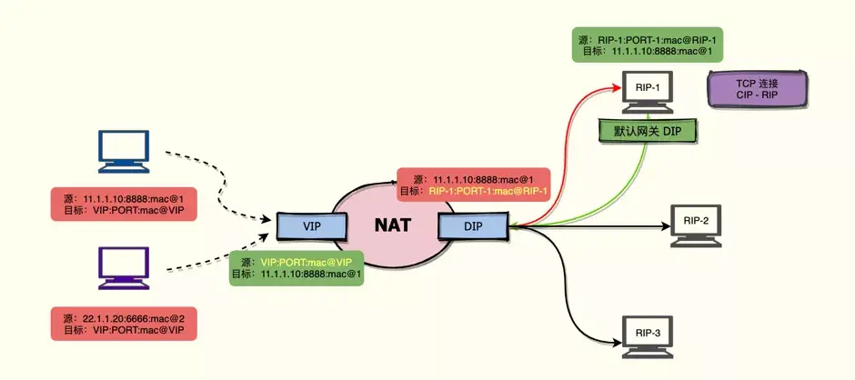
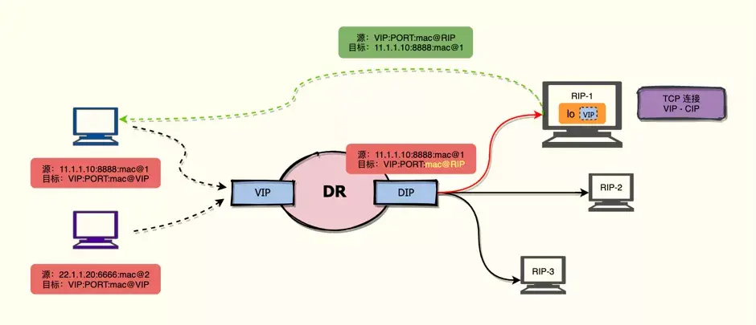
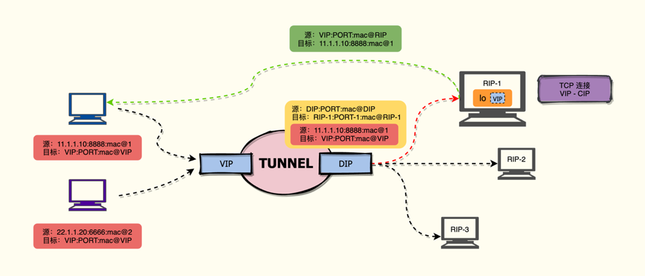

# 基本概念
数据包的发送链路为：CIP ➡ VIP ➡ DIP ➡ RIP，即 客户端 IP ➡ 虚拟 IP ➡ 分发 IP ➡ 真实服务器 IP

# 模式
红色表示发出的数据包，绿色表示返回的数据包，黄色表示负载均衡器修改的内容 ，虚线表示经过 N 个下一跳，即可以不在同一局域网内，实线表示只能 “跳跃一次”，即必须在同一局域网内。

## NAT 模式

## DR 模式

## TUN 模式

