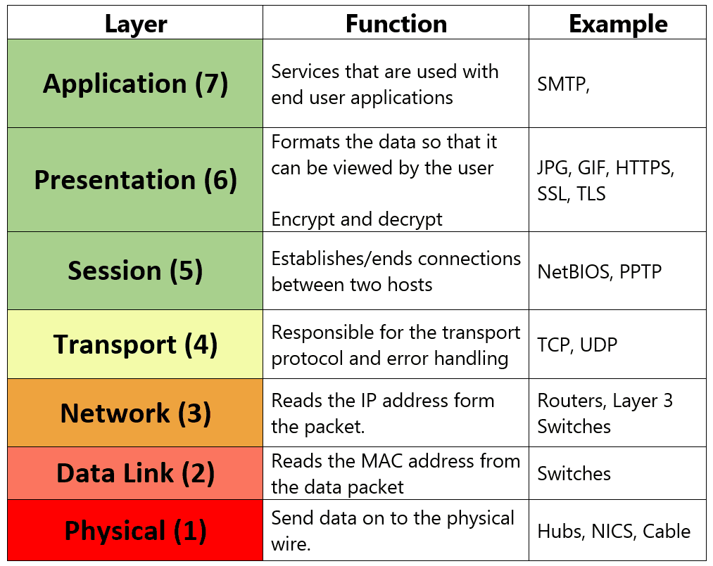
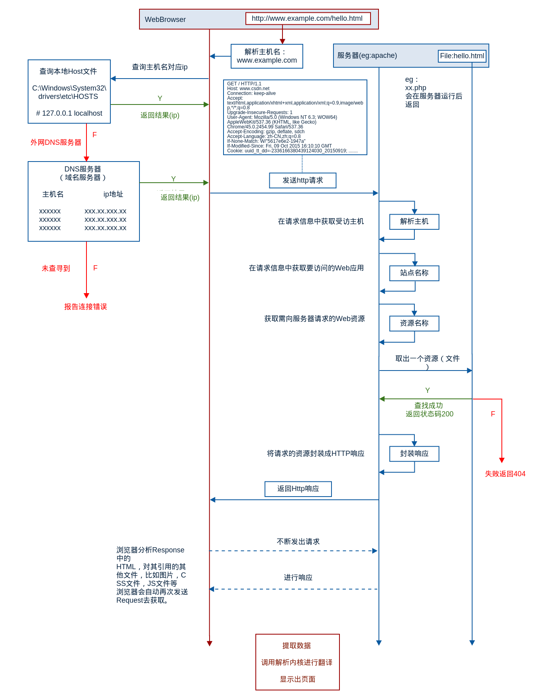

- [OSI Layers](#osi-layers)
- [通过浏览器访问网站基本流程](#通过浏览器访问网站基本流程)
- [域名解析的顺序](#域名解析的顺序)
- [IP 地址网关](#ip-地址网关)
- [查看目标 IP 地址的路由路径](#查看目标-ip-地址的路由路径)
- [ARP 协议](#arp-协议)
  - [概念](#概念)
  - [ARP 跟 VRRP 关系](#arp-跟-vrrp-关系)
  - [查看 ARP 缓存](#查看-arp-缓存)
  - [清空ARP缓存](#清空arp缓存)
  - [查看 ARP 缓存配置](#查看-arp-缓存配置)

# OSI Layers




# 通过浏览器访问网站基本流程


# 域名解析的顺序
1. /etc/hosts
2. /etc/resolv.conf (包含了DNS服务器的IP地址和其他配置信息)
3. 其他解析方法，如mDNS等
```sh
$ cat /etc/hosts | egrep -v '^#|^$'
127.0.1.1 localhost.localdomain VM-0-6-ubuntu
127.0.0.1 localhost
::1 ip6-localhost ip6-loopback
fe00::0 ip6-localnet
ff00::0 ip6-mcastprefix
ff02::1 ip6-allnodes
ff02::2 ip6-allrouters
ff02::3 ip6-allhosts
```
```sh
$ cat /etc/resolv.conf | egrep -v '^#|^$'
nameserver 127.0.0.53  # nameserver指令定义了要使用的DNS服务器的IP地址
options edns0 trust-ad
search .
```

# IP 地址网关
```sh
# 172.19.0.6的机器上
$ route -n
Kernel IP routing table
Destination     Gateway         Genmask         Flags Metric Ref    Use Iface
0.0.0.0         172.19.0.1      0.0.0.0         UG    100    0        0 eth0
172.19.0.0      0.0.0.0         255.255.240.0   U     100    0        0 eth0
172.19.0.1      0.0.0.0         255.255.255.255 UH    100    0        0 eth0
183.60.82.98    172.19.0.1      255.255.255.255 UGH   100    0        0 eth0
183.60.83.19    172.19.0.1      255.255.255.255 UGH   100    0        0 eth0

#或者
$ route
Kernel IP routing table
Destination     Gateway         Genmask         Flags Metric Ref    Use Iface
default         _gateway        0.0.0.0         UG    100    0        0 eth0
172.19.0.0      0.0.0.0         255.255.240.0   U     100    0        0 eth0
_gateway        0.0.0.0         255.255.255.255 UH    100    0        0 eth0
183.60.82.98    _gateway        255.255.255.255 UGH   100    0        0 eth0
183.60.83.19    _gateway        255.255.255.255 UGH   100    0        0 eth0
```
其中
```sh
Destination：目的地址，可以是网络地址或单个主机地址。
Gateway：路由到目的地址所使用的网关地址。当目的地址是本地网络时，该列为0.0.0.0。
Genmask：子网掩码，用于指定目的地址所属的网络范围。
Flags：一些标志，包括U（路由有效）、G（该路由的目标地址是一个网关）和H（目标地址为主机地址）等。
Metric：路由距离值，用于确定距离本地计算机最近的路由器。值越小，路由越近。
Ref：路由缓存的引用计数器，用于指示多少个进程正在使用该路由缓存。
Use：该路由缓存的使用计数器，表示该路由缓存自启动以来已被使用多少次。
Iface：路由器使用的网络接口名称。
```

# 查看目标 IP 地址的路由路径
traceroute显示的第一跳地址并不一定是在系统的路由表中设置的下一跳地址。它可能是数据包传输路径上的第一个路由器。所以在route命令中看不到这个地址
```sh
$ tcptraceroute 172.217.27.46
Selected device eth0, address 172.19.0.6, port 54527 for outgoing packets
Tracing the path to 172.217.27.46 on TCP port 80 (http), 30 hops max
 1  * 11.84.200.193 0.476 ms *
 2  11.84.247.64  0.385 ms  0.411 ms  0.286 ms
 3  10.162.72.249  0.683 ms  1.318 ms  0.636 ms
 4  10.162.32.162  0.881 ms  0.881 ms  1.057 ms
 5  72.14.223.150  2.430 ms  2.468 ms  2.407 ms
 6  142.250.63.187  2.845 ms  0.883 ms  0.863 ms
 7  108.170.225.13  0.833 ms  0.839 ms  0.799 ms
 8  sin11s03-in-f14.1e100.net (172.217.27.46) [open]  0.659 ms  0.710 ms  0.686 ms
```

# ARP 协议

## 概念

ARP（Address Resolution Protocol）协议是用于将IP地址映射到物理MAC地址的网络协议，它是TCP/IP协议栈中的一个重要组成部分。ARP协议工作在OSI模型的第二层（数据链路层）和第三层（网络层）之间，它的作用是通过发送ARP请求和ARP响应包来建立IP地址与MAC地址之间的映射关系。

## ARP 跟 VRRP 关系

当VRRP主设备在网络上发送数据包时，它使用其VRRP MAC地址作为源MAC地址，将数据包发送到网络。其他设备在收到这些数据包时，会向ARP缓存中添加VRRP虚拟IP地址和VRRP MAC地址的映射关系。这样，当其他设备需要向虚拟IP地址发送数据包时，它们可以向VRRP MAC地址发送ARP请求，以获取目标虚拟IP地址的物理地址。这样，VRRP和ARP协议协同工作，可以实现网络冗余和负载均衡。

## 查看 ARP 缓存

```sh
$ arp -a
? (172.1.1.252) at 80:61:6c:75:e3:b5 [ether] on eth0
gateway (172.1.1.254) at 00:00:5e:00:01:e5 [ether] on eth0
? (172.1.1.79) at fa:16:3e:a6:bc:c0 [ether] on eth0
? (172.1.1.81) at fa:16:3e:42:9a:60 [ether] on eth0
? (172.1.1.83) at fa:16:3e:c7:e6:f1 [ether] on eth0
? (172.1.1.53) at fa:16:3e:e1:a3:2b [ether] on eth0
? (172.1.1.51) at fa:16:3e:a1:40:e6 [ether] on eth0
? (172.1.1.1) at fa:16:3e:9e:1c:a9 [ether] on eth0
? (172.1.1.3) at fa:16:3e:e6:f8:68 [ether] on eth0
? (172.1.1.253) at 80:61:6c:75:e7:05 [ether] on eth0
? (172.1.1.84) at fa:16:3e:61:93:bc [ether] on eth0
? (172.1.1.80) at fa:16:3e:f2:4c:d5 [ether] on eth0
? (172.1.1.82) at fa:16:3e:58:d2:5c [ether] on eth0
? (172.1.1.56) at fa:16:3e:ce:36:1f [ether] on eth0
? (172.1.1.52) at fa:16:3e:a8:9c:ba [ether] on eth0
? (172.1.1.54) at fa:16:3e:97:36:d4 [ether] on eth0
? (172.1.1.2) at fa:16:3e:4a:67:e4 [ether] on eth0
```

```
$ arp 172.1.1.114
172.1.1.114 (172.1.1.114) -- no entry
```

## 清空ARP缓存

```sh
arp -d 172.1.1.114
```

## 查看 ARP 缓存配置

`/proc/sys/net/ipv4/neigh/default/`目录下的文件是用来配置Linux系统的ARP（Address Resolution Protocol）缓存的。ARP缓存用于在IP地址和MAC地址之间进行映射，以便在网络上正确传递数据包。

| 文件名                     | 作用                                        | 默认值 | 重要性 |
| -------------------------- | ------------------------------------------- | ------ | ------ |
| `app_solicit`            | 发送ARP请求前等待的时间（以秒为单位）       | 0      |        |
| `base_reachable_time`    | ARP缓存中条目的最小存活时间（以毫秒为单位） | 30000  |        |
| `delay_first_probe_time` | 发送ARP请求的延迟时间（以秒为单位）         | 5      |        |
| `gc_interval`            | 定期清理ARP缓存的时间间隔（以秒为单位）     | 30     | ✓     |
| `gc_stale_time`          | ARP缓存中条目的过期时间（以秒为单位）       | 300    |        |
| `locktime`               | 在ARP缓存中锁定条目的时间（以秒为单位）     | 0      |        |
| `mcast_solicit`          | 发送ARP请求时的最大多播次数                 | 3      |        |
| `proxy_delay`            | 代理ARP请求的延迟时间（以秒为单位）         | 0      |        |
| `proxy_qlen`             | 代理ARP请求队列的最大长度                   | 64     | ✓     |
| `retrans_time`           | 重新发送ARP请求的时间间隔（以秒为单位）     | 1      |        |
| `unres_qlen`             | 未解析的ARP请求队列的最大长度               | 3      |        |

这些配置参数的默认值通常可以满足大多数应用场景，但在一些特殊情况下，可能需要根据实际情况进行调整。可以通过修改这些文件来更改参数的值，例如：

<pre><div class="bg-black rounded-md mb-4"><div class="p-4 overflow-y-auto"><code class="!whitespace-pre hljs language-bash"><span class="hljs-built_in">echo</span> <span class="hljs-string">"300"</span> > /proc/sys/net/ipv4/neigh/default/gc_stale_time
</code></div></div></pre>

上述命令将ARP缓存中条目的过期时间设置为300秒。如果需要使更改永久生效，可以在 `/etc/sysctl.conf`文件中添加相应的配置，例如：

<pre><div class="bg-black rounded-md mb-4"><div class="p-4 overflow-y-auto"><code class="!whitespace-pre hljs language-arduino">net.ipv4.neigh.<span class="hljs-keyword">default</span>.gc_stale_time = <span class="hljs-number">300</span>
</code></div></div></pre>

这样就可以使更改生效了。
