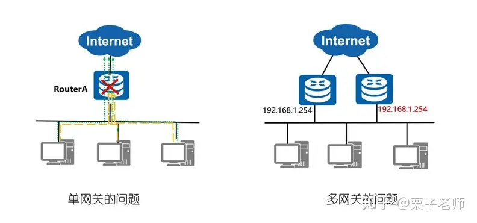
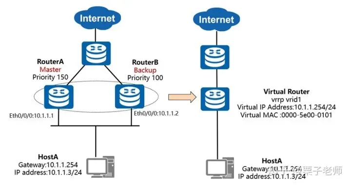
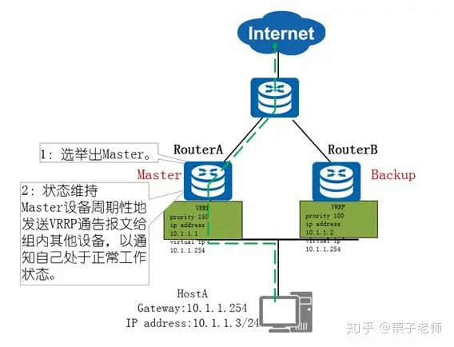
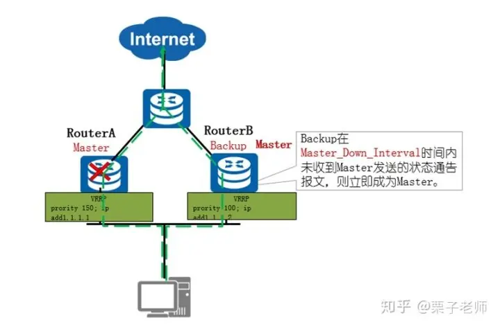
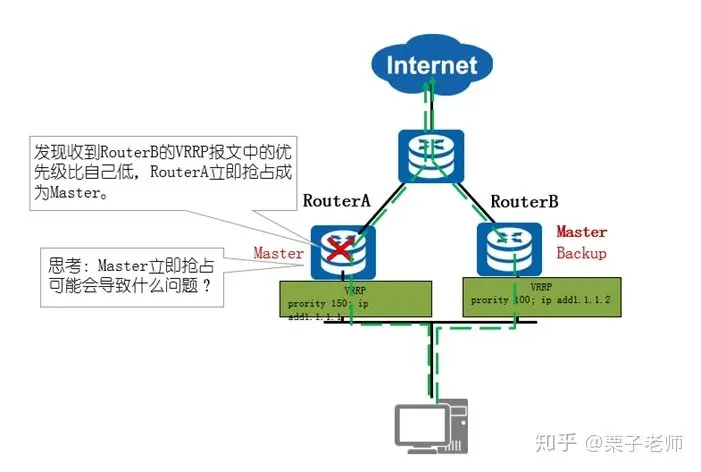
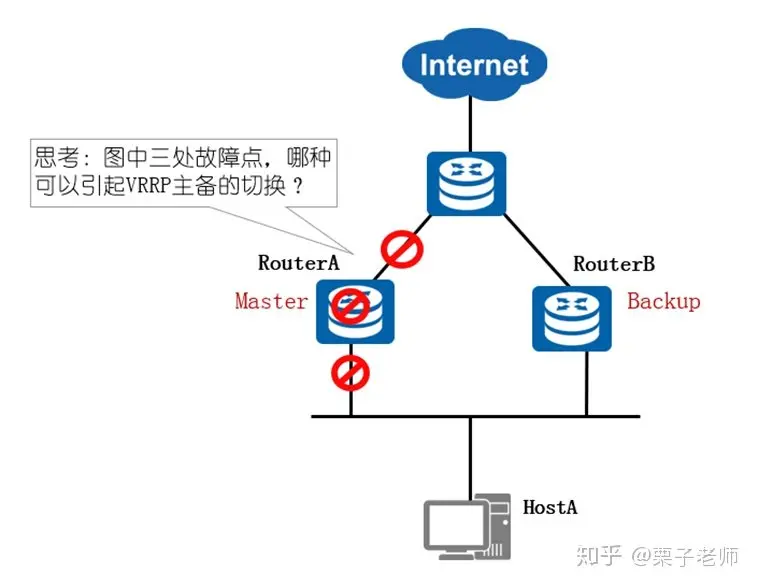
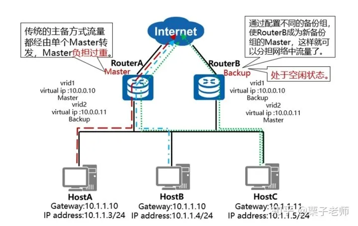
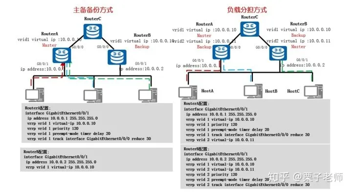

# VRRP诞生的背景介绍

当网关路由器RouterA出现故障时，本网段内以该设备为网关的主机都不能与Internet进行通信

多网关可能会出现一些问题：网关间IP地址冲突；主机会频繁切换网络出口



# VRRP的工作原理

VRRP能够在不改变组网的情况下，将多台路由器虚拟成一个虚拟路由器，通过配置虚拟路由器的IP地址为默认网关，实现网关的备份

协议版本：VRRPv2（常用）和VRRPv3 VRRPv2仅适用于IPv4网络，VRRPv3适用于IPv4和IPv6两种网络。

VRRP协议报文：只有一种报文：Advertisement报文 其目的IP地址是224.0.0.18，目的MAC地址是00-00-5e-00-01-XX，协议号是112,VRRP是网络层协议
# VRRP基本概念

虚拟路由器（Virtual Router）：由一个Master设备和多个Backup设备组成，被当作一个共享局域网内主机的缺省网关。如RouterA和RouterB共同组成了一个虚拟路由器。

Master路由器（Virtual Router Master）：承担转发报文任务的VRRP设备，如RouterA。 Backup路由器（Virtual Router Backup）：一组没有承担转发任务的VRRP设备，当Master设备出现故障时，它们将通过竞选成为新的Master设备，如RouterB。

Priority：设备在备份组中的优先级，取值范围是0~255。 0表示设备停止参与VRRP备份组，用来使备份设备尽快成为Master设备，而不必等到计时器超时；255则保留给IP地址拥有者，无法手工配置；设备缺省优先级值是100。

vrid：虚拟路由器的标识，如图中RouterA和RouterB组成的虚拟路由器的vrid为1，需手工指定，范围1-255。

虚拟IP地址(Virtual IP Address)：虚拟路由器的IP地址，一个虚拟路由器可以有一个或多个IP地址，由用户配置。如RouterA和RouterB组成的虚拟路由器的虚拟IP地址为10.1.1.254/24。

IP地址拥有者（IP Address Owner）：如果一个VRRP设备将真实的接口IP地址配置为虚拟路由器IP地址，则该设备被称为IP地址拥有者。如果IP地址拥有者是可用的，则它将一直成为Master。

虚拟MAC地址（Virtual MAC Address）：虚拟路由器根据vrid生成的MAC地址。一个虚拟路由器拥有一个虚拟MAC地址，格式为：00-00-5E-00-01-{vrid} 。当虚拟路由器回应ARP请求时，使用虚拟MAC地址，而不是接口的真实MAC地址。如RouterA和RouterB组成的虚拟路由器的vrid为1，因此这个VRRP备份组的MAC地址为00-00-5E-00-01-01。

VRRP协议状态机有三种状态：Initialize（初始状态）、Master（活动状态）、Backup（备状态）



# VRRP主备备份工作过程
## 第一步：选举出Master

VRRP备份组中的设备根据优先级选举出Master。Master设备通过发送免费ARP报文，将虚拟MAC地址通知给与它连接的设备或者主机，从而承担报文转发任务。

选举规则：比较优先级的大小，优先级高者当选为Master设备。当两台设备优先级相同时，如果已经存在Master，则其保持Master身份，无需继续选举；如果不存在Master，则继续比较接口IP地址大小，接口IP地址较大的设备当选为Master设备。

## 第二步：Master设备状态的通告（VRRP备份组状态维持）

Master设备周期性地发送VRRP通告报文，在VRRP备份组中公布其配置信息（优先级等）和工作状况。Backup设备通过接收到的VRRP报文来判断Master设备是否工作正常。

当Master设备主动放弃Master地位（如Master设备退出备份组）时，会发送优先级为0的通告报文，用来使Backup设备快速切换成Master设备，而不用等到Master_Down_Interval（默认为3s）定时器超时。这个切换的时间称为Skew_Time（几乎可以堪称0s），计算方式为：（256－Backup设备的优先级）/256，单位为秒。

当Master设备发生网络故障而不能发送通告报文的时候，Backup设备并不能立即知道其工作状况。等到Master_Down_Interval定时器超时后，才会认为Master设备无法正常工作，从而将状态切换为Master。其中，Master_Down_Interval定时器取值为：3×Advertisement_Interval＋Skew_Time，单位为秒。其中Advertisement_Interval默认情况下为1S



# VRRP主备切换过程
## 如果Master发生故障，则主备切换的过程

当组内的备份设备一段时间（Master_Down_Interval定时器取值为：3×Advertisement_Interval＋Skew_Time，单位为秒）内没有接收到来自Master设备的报文，则将自己转为Master设备。

一个VRRP组里有多台备份设备时，短时间内可能产生多个Master设备，此时，设备将会对收到的VRRP报文中的优先级与本地优先级做比较，从而选取优先级高的设备成为Master。 设备的状态变为Master之后，会立刻发送免费ARP来刷新交换机上的MAC表项，从而把用户的流量引到此设备上来，整个过程对用户完全透明。



## 如果原Master故障恢复，则主备回切的过程：

抢占模式（Preemption Mode）：缺省为抢占模式

控制具有更高优先级的备用路由器是否能够抢占具有较低优先级的Master路由器，使自己成为Master。 注意：存在的例外情况是如果IP地址拥有者是可用的，则它总是处于抢占的状态，并成为Master设备。 抢占延时（Delay Time）：抢占延迟时间，默认为0，即立即抢占。

图中RouterA故障恢复后，立即抢占可能会导致流量中断，因为RouterA的上行链路的路由协议可能未完成收敛，这种情况则需要配置Master设备的抢占延时。

另外，在性能不稳定的网络中，网络堵塞可能导致Backup设备在Master_Down_Interval期间没有收到Master设备的报文，Backup设备则会主动切换为Master。如果此时原Master设备的报文又到达了，新Master设备将再次切换回Backup，如此则会出现VRRP备份组成员状态频繁切换的现象。为了缓解这种现象，可以配置抢占延时，使得Backup设备在等待了Master_Down_Interval时间后，再等待抢占延迟时间。如在此期间仍没有收到通告报文，Backup设备才会切换为Master设备。



# VRRP故障场景

解决的问题：VRRP无法感知非运行VRRP接口的状态变化，故当上行链路出现故障时，VRRP无法进行感知，不会进行主备切换，从而导致业务中断。

解决方案：利用VRRP的联动功能监视上行接口或链路故障，主动进行主备切换。



# VRRP负载分担工作过程

负载分担是指多个VRRP备份组同时承担业务转发，VRRP负载分担与VRRP主备备份的基本原理和报文协商过程都是相同的。对于每一个VRRP备份组，都包含一个Master设备和若干Backup设备。

与主备备份方式的不同点在于：负载分担方式需要建立多个VRRP备份组，各备份组的Master设备分担在不同设备上；单台设备可以加入多个备份组，在不同的备份组中扮演不同的角色。




# VRRP的基本配置


(下面配置格式可能有误)  
主备备份方式的配置文件 RA的配置文件
```
<code class="language-text"># sysname RA#interface GigabitEthernet0/0/0 ip address 13.1.1.1 255.255.255.0 #interface GigabitEthernet0/0/1 ip address 10.0.0.1 255.255.255.0 vrrp vrid 1 virtual-ip 10.0.0.10 vrrp vrid 1 priority 120 vrrp vrid 1 preempt-mode timer delay 20 vrrp vrid 1 track interface GigabitEthernet0/0/0 reduced 30#
</code>
```
RB的配置文件
```
<code class="language-text"># sysname RB#interface GigabitEthernet0/0/1 ip address 10.0.0.2 255.255.255.0 vrrp vrid 1 virtual-ip 10.0.0.10#
</code>
```
RC的配置文件
```
<code class="language-text"># 
sysname RCinterface GigabitEthernet0/0/0 ip address 13.1.1.3 255.255.255.0 #
</code>
```

检查： 在RA上查看检查的状态
```
<code class="language-text">[RA]display vrrp GigabitEthernet0/0/1 | Virtual Router 1 State : Master Virtual IP : 10.0.0.10 Master IP : 10.0.0.1 PriorityRun : 120 PriorityConfig : 120 MasterPriority : 120 Preempt : YES Delay Time : 20 s TimerRun : 1 s TimerConfig : 1 s Auth type : NONE Virtual MAC : 0000-5e00-0101 Check TTL : YES Config type : normal-vrrp Backup-forward : disabled Track IF : GigabitEthernet0/0/0 Priority reduced : 30 IF state : UP Create time : 2019-09-28 09:06:52 UTC-08:00 Last change time : 2019-09-28 09:10:00 UTC-08:00
</code>
```
[RA] 在RB上面查看VRRP的状态
```
<code class="language-text">[RB]display vrrp GigabitEthernet0/0/1 | Virtual Router 1 State : Backup Virtual IP : 10.0.0.10 Master IP : 10.0.0.1 PriorityRun : 100 PriorityConfig : 100 MasterPriority : 120 Preempt : YES Delay Time : 0 s TimerRun : 1 s TimerConfig : 1 s Auth type : NONE Virtual MAC : 0000-5e00-0101 Check TTL : YES Config type : normal-vrrp Backup-forward : disabled Create time : 2019-09-28 09:08:27 UTC-08:00 Last change time : 2019-09-28 09:10:02 UTC-08:00[RB]
</code>
```
# 总结VRRP master和backup的配置

Master设备配置：
```
<code class="language-text">
vrrp vrid 1 virtual-ip 10.0.0.10 //配置vrid1中的虚拟IP地址。
vrrp vrid 1 priority 120 //配置在vrid1中的优先级为120，其他设备优先级未手动指定，缺省为100，则本设备为Master。vrrp vrid 1 preempt-mode timer delay 20 //配置Master设备的抢占时延为20秒。
vrrp vrid 1 track interface Gigabit Ethernet0/0/0 reduce 30 //跟踪上行接口G0/0/0的状态，如果端口出现故障，则Master设备VRRP优先级降低30。
</code>
```

Backup设备配置：
```
<code class="language-text">vrrp vrid 1 virtual-ip 10.0.0.10 //配置vrid1中的虚拟IP地址。
ernet0/0/0 reduce 30 //跟踪上行接口G0/0/0的状态，如果端口出现故障，则Master设备VRRP优先级降低30。
</code>
```
Backup设备配置：
```
<code class="language-text">vrrp vrid 1 virtual-ip 10.0.0.10 //配置vrid1中的虚拟IP地址。
</code>
```