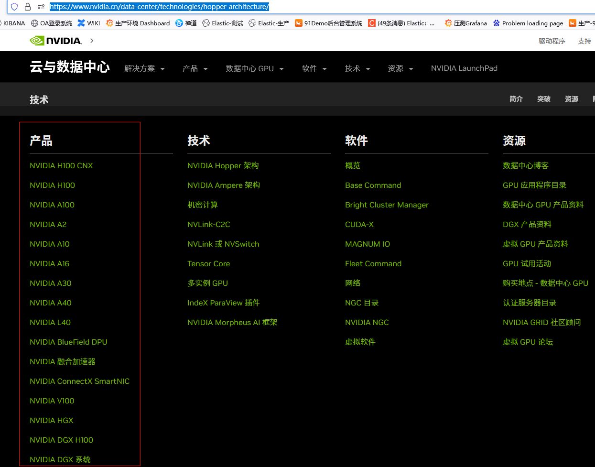

- [Nvdia 官网](#nvdia-官网)
  - [GPU驱动安装相关说明](#gpu驱动安装相关说明)
    - [相关解释](#相关解释)
  - [市面上常见GPU 型号](#市面上常见gpu-型号)
  - [查看GPU资源使用情况](#查看gpu资源使用情况)


## Nvdia 官网
https://www.nvidia.cn/data-center/technologies/hopper-architecture/




## GPU驱动安装相关说明

### 相关解释

* #### GPU驱动

  GPU驱动是用来驱动GPU的程序，GPU云服务器正常工作依赖于GPU驱动的正确安装。
* #### CUDA

  CUDA（Compute Unified Device Architecture）是显卡厂商 NVIDIA
  推出的运算平台。CUDA™ 是一种由 NVIDIA 推出的通用并行计算架构，该架构使 GPU 能够解决复杂的计算问题。它包含了 CUDA
  指令集架构（ISA）以及 GPU 内部的并行计算引擎。

  GPU 云服务器采用 NVIDIA 显卡，则需要安装 CUDA 开发运行环境。
* #### cuDNN

  cuDNN是用于深度神经网络的GPU加速库。


## 市面上常见GPU 型号

这是一个表格，它比较了 RTX 3090，A10 和 A30 的一些性能参数：

| GPU      | 架构   | 显存类型 | 显存容量 | NVLink 高速互联技术 | ECC 校验 | 价格 | 上市时间 |
| -------- | ------ | -------- | -------- | ------------------- | -------- | -------- | -------- |
| RTX 3090 | Ampere | GDDR6X   | 24GB     | 支持                | 不支持   | 	1500 美元 | 2020年9月24日 |
| A10      | Ampere | GDDR6    | 24GB     | 不支持              | 不支持   | 无法确定 | 2021年 |
| A30      | Ampere | HBM2     | 24GB     | 支持                | 支持     | 无法确定 | 2021年 |
| A100      | Ampere |      |   40GB/80GB   |                 |      | 19.9万美元 |  |

RTX 3090 和 A30 都是基于Ampere架构，但 RTX 3090 属于高端游戏卡，适用于消费级娱乐领域，A30 是英伟达数据中心 GPU，适用于专业 AI、高性能计算领域。显存方面，RTX 3090 和 A30 都是 24GB 的容量，但是 A30 配备的是 HBM2 显存，而且支持 NVLink 高速互联技术，最高传输速度达到 200 GB/秒，而 GeForce 仅支持 PCIe 通道。

A10 是英伟达新推出的数据中心 GPU，采用单槽全长尺寸，被动式散热设计，核心基于 GA102-890 SKU，拥有 72 组 SM 单元，9216 个 CUDA 核心。其基础频率为 855MHz，可加速至 1695MHz，384-bit 位宽，24GB GDDR6 显存。


## 查看GPU资源使用情况

```plaintext
nvidia-smi

Tue Jun 20 11:28:01 2023     
+---------------------------------------------------------------------------------------+
| NVIDIA-SMI 530.30.02              Driver Version: 530.30.02    CUDA Version: 12.1     |
|-----------------------------------------+----------------------+----------------------+
| GPU  Name                  Persistence-M| Bus-Id        Disp.A | Volatile Uncorr. ECC |
| Fan  Temp  Perf            Pwr:Usage/Cap|         Memory-Usage | GPU-Util  Compute M. |
|                                         |                      |               MIG M. |
|=========================================+======================+======================|
|   0  Tesla T4                        Off| 00000000:00:08.0 Off |                  Off |
| N/A   65C    P0               52W /  70W|  15363MiB / 16384MiB |     44%      Default |
|                                         |                      |                  N/A |
+-----------------------------------------+----------------------+----------------------+

+---------------------------------------------------------------------------------------+
| Processes:                                                                            |
|  GPU   GI   CI        PID   Type   Process name                            GPU Memory |
|        ID   ID                                                             Usage      |
|=======================================================================================|
|    0   N/A  N/A     27051      C   python                                    15358MiB |
+---------------------------------------------------------------------------------------+


或者
apt install nvtop
nvtop
```

# 网卡管理
```sh
nmcli connection down  eth0
ifconfig eth0 down
```