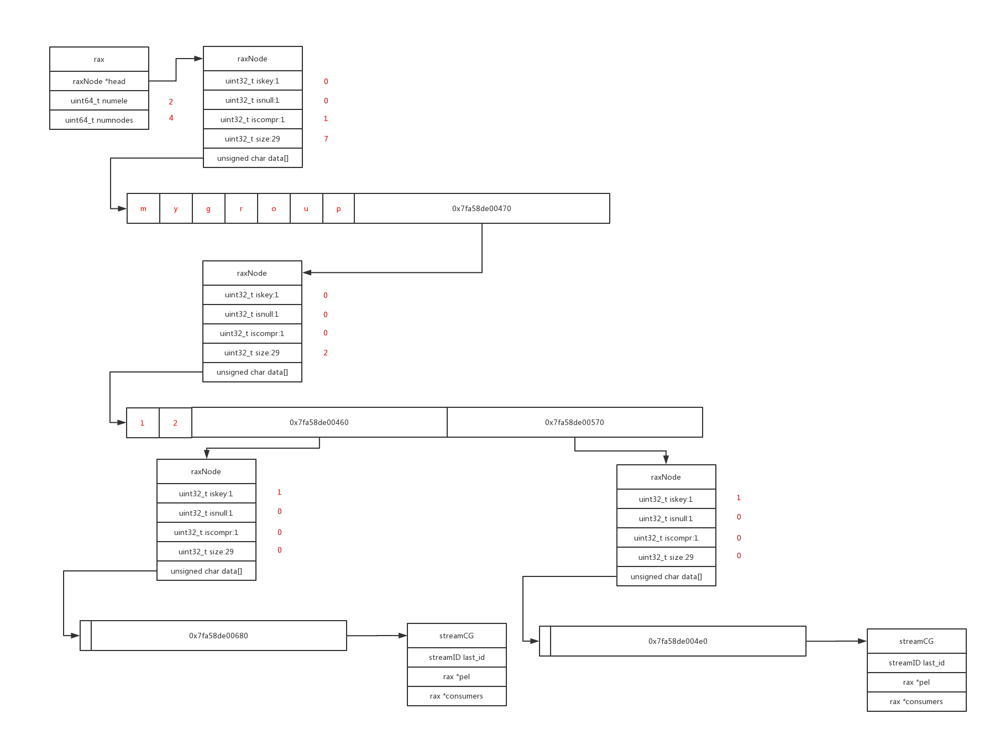

- [Redis Cluster 安装部署](#redis-cluster-安装部署)
  - [提前准备好各实例的配置文件，以6401为例](#提前准备好各实例的配置文件以6401为例)
  - [启动各Redis实例](#启动各redis实例)
  - [搭建Redis Cluster](#搭建redis-cluster)
  - [检查集群是否搭建完成、槽完全被分配](#检查集群是否搭建完成槽完全被分配)
  - [添加新节点到集群](#添加新节点到集群)
  - [给新节点分配槽](#给新节点分配槽)
  - [新节点置为从库](#新节点置为从库)
  - [收缩集群](#收缩集群)
  - [集群全局命令](#集群全局命令)
  - [集群节点命令](#集群节点命令)
  - [其它操作](#其它操作)
- [redis主从哨兵和集群的区别](#redis主从哨兵和集群的区别)
- [常用操作](#常用操作)
  - [关闭、启动](#关闭启动)
  - [基本命令](#基本命令)
- [主从复制命令](#主从复制命令)
- [查找大KEY](#查找大key)
- [Redis数据类型](#redis数据类型)
  - [字符串](#字符串)
  - [散列/哈希  每个散列/哈希可以存储多达2^32 - 1个健-值对(超过40亿个)](#散列哈希--每个散列哈希可以存储多达232---1个健-值对超过40亿个)
  - [列表](#列表)
  - [集合](#集合)
  - [可排序集合](#可排序集合)
- [REDIS跟MYSQL数据同步](#redis跟mysql数据同步)
- [击穿、穿透、雪崩](#击穿穿透雪崩)
  - [击穿](#击穿)
  - [穿透](#穿透)
  - [雪崩](#雪崩)
- [常用命令的函数调用链](#常用命令的函数调用链)
  - [set](#set)
  - [meet](#meet)
  - [forget](#forget)
  - [hmset](#hmset)
  - [lpush](#lpush)
  - [sadd](#sadd)
  - [zadd](#zadd)
  - [hash表查找](#hash表查找)
  - [gossip](#gossip)
  - [accept接受连接](#accept接受连接)
- [VSCODE调试redis的配置](#vscode调试redis的配置)
- [进程的文件句柄、端口查看](#进程的文件句柄端口查看)
- [客户端连接服务端时，为什么服务端触发两次EPOLLOUT](#客户端连接服务端时为什么服务端触发两次epollout)
  - [原因](#原因)
  - [服务端限制返回包最大64k](#服务端限制返回包最大64k)
  - [为什么客户端连接服务端后，服务端会返回那么大的包](#为什么客户端连接服务端后服务端会返回那么大的包)
- [查看RDB文件](#查看rdb文件)
- [rax结构](#rax结构)
- [源码阅读网站](#源码阅读网站)
- [源码文件描述](#源码文件描述)
- [redis跨机房部署方案](#redis跨机房部署方案)

# Redis Cluster 安装部署

参考 https://blog.csdn.net/zimu312500/article/details/123466423

OS 8.0
Redis  7.0
Redis node1 Master 127.0.0.1 6401 /data/redis/data/6401
Redis node1 Slave 127.0.0.1 6402 /data/redis/data/6402
Redis node2 Master 127.0.0.1 6403 /data/redis/data/6403
Redis node2 Slave 127.0.0.1 6404 /data/redis/data/6404
Redis node3 Master 127.0.0.1 6405 /data/redis/data/6405
Redis node3 Slave 127.0.0.1 6406 /data/redis/data/6406

```sh
wget https://download.redis.io/redis-stable.tar.gz  
tar -xzvf redis-stable.tar.gz  
cd redis-stable  
make  

mkdir -p /data/redis/{bin,data,conf,log}  
mkdir -p /data/redis/data/{6401..6406}  
make PREFIX=/data/redis/bin install  

./redis-server --version  
Redis server v=7.0.2 sha=00000000:0 malloc=jemalloc-5.2.1 bits=64 build=317a0dc33f11edb5
```

## 提前准备好各实例的配置文件，以6401为例

```sh
bind 0.0.0.0  
port 6401  
pidfile /var/run/redis_6401.pid  
logfile ""/data/redis/log/redis_6401.log""  
dir /data/redis/data/6401  
cluster-enabled yes  
cluster-node-timeout 15000  
cluster-config-file ""nodes-6401.conf""  
daemonize yes  
protected-mode yes
tcp-backlog 511  
timeout 0  
tcp-keepalive 300  
supervised no  
loglevel notice  
databases 16  
always-show-logo yes  
save 900 1  
save 300 10  
save 60 10000  
stop-writes-on-bgsave-error yes  
rdbcompression yes  
rdbchecksum yes  
dbfilename dump.rdb  
replica-serve-stale-data yes  
replica-read-only yes  
repl-diskless-sync no  
repl-diskless-sync-delay 5  
repl-disable-tcp-nodelay no  
replica-priority 100  
lazyfree-lazy-eviction no  
lazyfree-lazy-expire no  
lazyfree-lazy-server-del no  
replica-lazy-flush no  
appendonly no  
appendfilename ""appendonly.aof""  
appendfsync everysec  
no-appendfsync-on-rewrite no  
auto-aof-rewrite-percentage 100  
auto-aof-rewrite-min-size 64mb  
aof-load-truncated yes  
aof-use-rdb-preamble yes  
lua-time-limit 5000  
slowlog-log-slower-than 10000  
slowlog-max-len 128  
latency-monitor-threshold 0  
notify-keyspace-events """"  
hash-max-ziplist-entries 512  
hash-max-ziplist-value 64  
list-max-ziplist-size -2  
list-compress-depth 0  
set-max-intset-entries 512  
zset-max-ziplist-entries 128  
zset-max-ziplist-value 64  
hll-sparse-max-bytes 3000  
stream-node-max-bytes 4096  
stream-node-max-entries 100  
activerehashing yes  
client-output-buffer-limit normal 0 0 0  
client-output-buffer-limit replica 256mb 64mb 60  
client-output-buffer-limit pubsub 32mb 8mb 60  
hz 10  
dynamic-hz yes  
aof-rewrite-incremental-fsync yes  
rdb-save-incremental-fsync yes
```

## 启动各Redis实例

```sh
redis-server /data/redis/conf/redis_6401.conf
redis-server /data/redis/conf/redis_6402.conf
redis-server /data/redis/conf/redis_6403.conf
redis-server /data/redis/conf/redis_6404.conf
redis-server /data/redis/conf/redis_6405.conf
redis-server /data/redis/conf/redis_6406.conf
```

## 搭建Redis Cluster

cluster-replicas 设置为1表示分配1个Slave节点

```sh
./redis-cli --cluster-replicas 1 --cluster create 127.0.0.1:6401 127.0.0.1:6402 127.0.0.1:6403 127.0.0.1:6404 127.0.0.1:6405 127.0.0.1:6406
>>> Performing hash slots allocation on 6 nodes...
Master[0] -> Slots 0 - 5460
Master[1] -> Slots 5461 - 10922
Master[2] -> Slots 10923 - 16383
Adding replica 127.0.0.1:6405 to 127.0.0.1:6401
Adding replica 127.0.0.1:6406 to 127.0.0.1:6402
Adding replica 127.0.0.1:6404 to 127.0.0.1:6403
>>> Trying to optimize slaves allocation for anti-affinity
[WARNING] Some slaves are in the same host as their master
M: 059779536a3fcbdd3e326f84dacc9bc5db52fa5b 127.0.0.1:6401
   slots:[0-5460] (5461 slots) master
M: b9aef8906f61806de8f84cfa6f90cde007c0bc9f 127.0.0.1:6402
   slots:[5461-10922] (5462 slots) master
M: 75fea4cb3b2622fcd2b983ecd65ef7d3091b8c2c 127.0.0.1:6403
   slots:[10923-16383] (5461 slots) master
S: c63b93805c90125453773de1458fd00ee3f26ae4 127.0.0.1:6404
   replicates 75fea4cb3b2622fcd2b983ecd65ef7d3091b8c2c
S: a6fb5f4722d526a1a96d434ea2d66b700c3a7ed2 127.0.0.1:6405
   replicates 059779536a3fcbdd3e326f84dacc9bc5db52fa5b
S: 23b3d4319ab60bafb545bbfbaa963b2b56fad120 127.0.0.1:6406
   replicates b9aef8906f61806de8f84cfa6f90cde007c0bc9f
Can I set the above configuration? (type 'yes' to accept): yes
>>> Nodes configuration updated
>>> Assign a different config epoch to each node
>>> Sending CLUSTER MEET messages to join the cluster
Waiting for the cluster to join
.
>>> Performing Cluster Check (using node 127.0.0.1:6401)
M: 059779536a3fcbdd3e326f84dacc9bc5db52fa5b 127.0.0.1:6401
   slots:[0-5460] (5461 slots) master
   1 additional replica(s)
S: c63b93805c90125453773de1458fd00ee3f26ae4 127.0.0.1:6404
   slots: (0 slots) slave
   replicates 75fea4cb3b2622fcd2b983ecd65ef7d3091b8c2c
S: 23b3d4319ab60bafb545bbfbaa963b2b56fad120 127.0.0.1:6406
   slots: (0 slots) slave
   replicates b9aef8906f61806de8f84cfa6f90cde007c0bc9f
M: 75fea4cb3b2622fcd2b983ecd65ef7d3091b8c2c 127.0.0.1:6403
   slots:[10923-16383] (5461 slots) master
   1 additional replica(s)
M: b9aef8906f61806de8f84cfa6f90cde007c0bc9f 127.0.0.1:6402
   slots:[5461-10922] (5462 slots) master
   1 additional replica(s)
S: a6fb5f4722d526a1a96d434ea2d66b700c3a7ed2 127.0.0.1:6405
   slots: (0 slots) slave
   replicates 059779536a3fcbdd3e326f84dacc9bc5db52fa5b
[OK] All nodes agree about slots configuration.
>>> Check for open slots...
>>> Check slots coverage...
[OK] All 16384 slots covered.
[root@VM-32-26-centos bin]#
```

## 检查集群是否搭建完成、槽完全被分配

```sh
./redis-cli --cluster check 127.0.0.1:6401
127.0.0.1:6401 (05977953...) -> 0 keys | 5461 slots | 1 slaves.
127.0.0.1:6403 (75fea4cb...) -> 0 keys | 5461 slots | 1 slaves.
127.0.0.1:6402 (b9aef890...) -> 0 keys | 5462 slots | 1 slaves.
[OK] 0 keys in 3 masters.
0.00 keys per slot on average.
>>> Performing Cluster Check (using node 127.0.0.1:6401)
M: 059779536a3fcbdd3e326f84dacc9bc5db52fa5b 127.0.0.1:6401
   slots:[0-5460] (5461 slots) master
   1 additional replica(s)
S: c63b93805c90125453773de1458fd00ee3f26ae4 127.0.0.1:6404
   slots: (0 slots) slave
   replicates 75fea4cb3b2622fcd2b983ecd65ef7d3091b8c2c
S: 23b3d4319ab60bafb545bbfbaa963b2b56fad120 127.0.0.1:6406
   slots: (0 slots) slave
   replicates b9aef8906f61806de8f84cfa6f90cde007c0bc9f
M: 75fea4cb3b2622fcd2b983ecd65ef7d3091b8c2c 127.0.0.1:6403
   slots:[10923-16383] (5461 slots) master
   1 additional replica(s)
M: b9aef8906f61806de8f84cfa6f90cde007c0bc9f 127.0.0.1:6402
   slots:[5461-10922] (5462 slots) master
   1 additional replica(s)
S: a6fb5f4722d526a1a96d434ea2d66b700c3a7ed2 127.0.0.1:6405
   slots: (0 slots) slave
   replicates 059779536a3fcbdd3e326f84dacc9bc5db52fa5b
[OK] All nodes agree about slots configuration.
>>> Check for open slots...
>>> Check slots coverage...
[OK] All 16384 slots covered.
[root@VM-32-26-centos bin]#
```

## 添加新节点到集群

添加新节点到集群，第一个地址为新节点IP和端口，第二个地址为集群中任意存在的节点即可

```sh
./redis-cli -p 6401 --cluster add-node 127.0.0.1:7401 127.0.0.1:6401
>>> Adding node 127.0.0.1:7401 to cluster 127.0.0.1:6401
>>> Performing Cluster Check (using node 127.0.0.1:6401)
M: 059779536a3fcbdd3e326f84dacc9bc5db52fa5b 127.0.0.1:6401
   slots:[0-5460] (5461 slots) master
   1 additional replica(s)
S: c63b93805c90125453773de1458fd00ee3f26ae4 127.0.0.1:6404
   slots: (0 slots) slave
   replicates 75fea4cb3b2622fcd2b983ecd65ef7d3091b8c2c
S: 23b3d4319ab60bafb545bbfbaa963b2b56fad120 127.0.0.1:6406
   slots: (0 slots) slave
   replicates b9aef8906f61806de8f84cfa6f90cde007c0bc9f
M: 75fea4cb3b2622fcd2b983ecd65ef7d3091b8c2c 127.0.0.1:6403
   slots:[10923-16383] (5461 slots) master
   1 additional replica(s)
M: b9aef8906f61806de8f84cfa6f90cde007c0bc9f 127.0.0.1:6402
   slots:[5461-10922] (5462 slots) master
   1 additional replica(s)
S: a6fb5f4722d526a1a96d434ea2d66b700c3a7ed2 127.0.0.1:6405
   slots: (0 slots) slave
   replicates 059779536a3fcbdd3e326f84dacc9bc5db52fa5b
[OK] All nodes agree about slots configuration.
>>> Check for open slots...
>>> Check slots coverage...
[OK] All 16384 slots covered.
>>> Getting functions from cluster
>>> Send FUNCTION LIST to 127.0.0.1:7401 to verify there is no functions in it
>>> Send FUNCTION RESTORE to 127.0.0.1:7401
>>> Send CLUSTER MEET to node 127.0.0.1:7401 to make it join the cluster.
[OK] New node added correctly.
[root@VM-32-26-centos bin]#
```

新节点添加成功后，可以使用 cluster nodes命令查看集群节点列表信息

```sh
./redis-cli -p 6401 cluster nodes
c63b93805c90125453773de1458fd00ee3f26ae4 127.0.0.1:6404@16404 slave 75fea4cb3b2622fcd2b983ecd65ef7d3091b8c2c 0 1655552360248 3 connected
23b3d4319ab60bafb545bbfbaa963b2b56fad120 127.0.0.1:6406@16406 slave b9aef8906f61806de8f84cfa6f90cde007c0bc9f 0 1655552360000 2 connected
18d36784879469a0c26d867193b6098360b473e6 127.0.0.1:7401@17401 master - 0 1655552361000 0 connected
75fea4cb3b2622fcd2b983ecd65ef7d3091b8c2c 127.0.0.1:6403@16403 master - 0 1655552361251 3 connected 10923-16383
059779536a3fcbdd3e326f84dacc9bc5db52fa5b 127.0.0.1:6401@16401 myself,master - 0 1655552358000 1 connected 0-5460
b9aef8906f61806de8f84cfa6f90cde007c0bc9f 127.0.0.1:6402@16402 master - 0 1655552360000 2 connected 5461-10922
a6fb5f4722d526a1a96d434ea2d66b700c3a7ed2 127.0.0.1:6405@16405 slave 059779536a3fcbdd3e326f84dacc9bc5db52fa5b 0 1655552359000 1 connected
[root@VM-32-26-centos bin]#
```

## 给新节点分配槽

Redis Cluster集群如果16384个槽全部被分配，那么分配槽给新加节点则需要使用reshard命令

```sh
./redis-cli -p 6401 --cluster  reshard 127.0.0.1:6401
>>> Performing Cluster Check (using node 127.0.0.1:6401)
M: 059779536a3fcbdd3e326f84dacc9bc5db52fa5b 127.0.0.1:6401
   slots:[0-5460] (5461 slots) master
   1 additional replica(s)
S: c63b93805c90125453773de1458fd00ee3f26ae4 127.0.0.1:6404
   slots: (0 slots) slave
   replicates 75fea4cb3b2622fcd2b983ecd65ef7d3091b8c2c
S: 23b3d4319ab60bafb545bbfbaa963b2b56fad120 127.0.0.1:6406
   slots: (0 slots) slave
   replicates b9aef8906f61806de8f84cfa6f90cde007c0bc9f
M: 18d36784879469a0c26d867193b6098360b473e6 127.0.0.1:7401
   slots: (0 slots) master
M: 75fea4cb3b2622fcd2b983ecd65ef7d3091b8c2c 127.0.0.1:6403
   slots:[10923-16383] (5461 slots) master
   1 additional replica(s)
M: b9aef8906f61806de8f84cfa6f90cde007c0bc9f 127.0.0.1:6402
   slots:[5461-10922] (5462 slots) master
   1 additional replica(s)
S: a6fb5f4722d526a1a96d434ea2d66b700c3a7ed2 127.0.0.1:6405
   slots: (0 slots) slave
   replicates 059779536a3fcbdd3e326f84dacc9bc5db52fa5b
[OK] All nodes agree about slots configuration.
>>> Check for open slots...
>>> Check slots coverage...
[OK] All 16384 slots covered.
How many slots do you want to move (from 1 to 16384)? 2500
What is the receiving node ID? 18d36784879469a0c26d867193b6098360b473e6
Please enter all the source node IDs.
  Type 'all' to use all the nodes as source nodes for the hash slots.
  Type 'done' once you entered all the source nodes IDs.
Source node #1: all

Ready to move 2500 slots.
  Source nodes:
    M: 059779536a3fcbdd3e326f84dacc9bc5db52fa5b 127.0.0.1:6401
       slots:[0-5460] (5461 slots) master
       1 additional replica(s)
    M: 75fea4cb3b2622fcd2b983ecd65ef7d3091b8c2c 127.0.0.1:6403
       slots:[10923-16383] (5461 slots) master
       1 additional replica(s)
    M: b9aef8906f61806de8f84cfa6f90cde007c0bc9f 127.0.0.1:6402
       slots:[5461-10922] (5462 slots) master
       1 additional replica(s)
  Destination node:
    M: 18d36784879469a0c26d867193b6098360b473e6 127.0.0.1:7401
       slots: (0 slots) master
  Resharding plan:
    Moving slot 5461 from b9aef8906f61806de8f84cfa6f90cde007c0bc9f
    Moving slot 5462 from b9aef8906f61806de8f84cfa6f90cde007c0bc9f
 ……
    Moving slot 11755 from 75fea4cb3b2622fcd2b983ecd65ef7d3091b8c2c
Do you want to proceed with the proposed reshard plan (yes/no)? yes
Moving slot 5461 from 127.0.0.1:6402 to 127.0.0.1:7401: 
Moving slot 5462 from 127.0.0.1:6402 to 127.0.0.1:7401: 
……
Moving slot 11755 from 127.0.0.1:6403 to 127.0.0.1:7401: 
[root@VM-32-26-centos bin]#
```

分配完毕后，通过cluster nodes查看槽位分配情况

```sh
./redis-cli -p 6401 cluster nodes
c63b93805c90125453773de1458fd00ee3f26ae4 127.0.0.1:6404@16404 slave 75fea4cb3b2622fcd2b983ecd65ef7d3091b8c2c 0 1655552726282 3 connected
23b3d4319ab60bafb545bbfbaa963b2b56fad120 127.0.0.1:6406@16406 slave b9aef8906f61806de8f84cfa6f90cde007c0bc9f 0 1655552726000 2 connected
18d36784879469a0c26d867193b6098360b473e6 127.0.0.1:7401@17401 master - 0 1655552727000 7 connected 0-832 5461-6294 10923-11755
75fea4cb3b2622fcd2b983ecd65ef7d3091b8c2c 127.0.0.1:6403@16403 master - 0 1655552727284 3 connected 11756-16383
059779536a3fcbdd3e326f84dacc9bc5db52fa5b 127.0.0.1:6401@16401 myself,master - 0 1655552724000 1 connected 833-5460
b9aef8906f61806de8f84cfa6f90cde007c0bc9f 127.0.0.1:6402@16402 master - 0 1655552728287 2 connected 6295-10922
a6fb5f4722d526a1a96d434ea2d66b700c3a7ed2 127.0.0.1:6405@16405 slave 059779536a3fcbdd3e326f84dacc9bc5db52fa5b 0 1655552726000 1 connected
[root@VM-32-26-centos bin]#
```

## 新节点置为从库

第一种是随机被分配到从库较少的主节点（--cluster-slave）

```sh
./redis-cli -p 6401 --cluster add-node 127.0.0.1:7402 127.0.0.1:6401 --cluster-slave
>>> Adding node 127.0.0.1:7402 to cluster 127.0.0.1:6401
>>> Performing Cluster Check (using node 127.0.0.1:6401)
M: 059779536a3fcbdd3e326f84dacc9bc5db52fa5b 127.0.0.1:6401
   slots:[833-5460] (4628 slots) master
   1 additional replica(s)
S: c63b93805c90125453773de1458fd00ee3f26ae4 127.0.0.1:6404
   slots: (0 slots) slave
   replicates 75fea4cb3b2622fcd2b983ecd65ef7d3091b8c2c
S: 23b3d4319ab60bafb545bbfbaa963b2b56fad120 127.0.0.1:6406
   slots: (0 slots) slave
   replicates b9aef8906f61806de8f84cfa6f90cde007c0bc9f
M: 18d36784879469a0c26d867193b6098360b473e6 127.0.0.1:7401
   slots:[0-832],[5461-6294],[10923-11755] (2500 slots) master
M: 75fea4cb3b2622fcd2b983ecd65ef7d3091b8c2c 127.0.0.1:6403
   slots:[11756-16383] (4628 slots) master
   1 additional replica(s)
M: b9aef8906f61806de8f84cfa6f90cde007c0bc9f 127.0.0.1:6402
   slots:[6295-10922] (4628 slots) master
   1 additional replica(s)
S: a6fb5f4722d526a1a96d434ea2d66b700c3a7ed2 127.0.0.1:6405
   slots: (0 slots) slave
   replicates 059779536a3fcbdd3e326f84dacc9bc5db52fa5b
[OK] All nodes agree about slots configuration.
>>> Check for open slots...
>>> Check slots coverage...
[OK] All 16384 slots covered.
Automatically selected master 127.0.0.1:7401
>>> Send CLUSTER MEET to node 127.0.0.1:7402 to make it join the cluster.
Waiting for the cluster to join

>>> Configure node as replica of 127.0.0.1:7401.
[OK] New node added correctly.
[root@VM-32-26-centos bin]#
```

第二种指定主节点建立复制关系，灾备场景、跨机房场景非常适用（--cluster-slave --cluster-master-id node_id）
除--cluster-slave外，还需使用--cluster-master-id指定需要复制的主节点node_id，该示例选择7401该主节点作为新节点的主库

```sh
redis-cli -p 6401 --cluster add-node 127.0.0.1:7402 127.0.0.1:6401 --cluster-slave --cluster-master-id 18d36784879469a0c26d867193b6098360b473e6
```

## 收缩集群

下线从节点

```sh
redis-cli --cluster del-node 127.0.0.1:7001 nodeID_7001
#del-node 后面跟着slave节点的 ip:port 和node ID
```

下线主节点

```sh
#先清空master的slot
redis-cli --cluster reshard 127.0.0.1:7000 --cluster-from nodeID_7000 --cluster-to nodeID_target --cluster-slots 1024 --cluster-yes
#下线（删除）节点
redis-cli --cluster del-node 127.0.0.1:7000 nodeID_7000
```

```sh
./redis-cli --cluster reshard 127.0.0.1:6379 --cluster-from e3d110e6bda857031747f21b60e00d8bd3071c4d --cluster-to 8dac64ca81f99d90d49dc790acf91841991d8963 --cluster-slots 10923-16383 --cluster-yes
……
Moving slot 16381 from 127.0.0.1:6381 to 127.0.0.1:6379: 
Moving slot 16382 from 127.0.0.1:6381 to 127.0.0.1:6379: 
Moving slot 16383 from 127.0.0.1:6381 to 127.0.0.1:6379:

./redis-cli --cluster del-node 127.0.0.1:6379 e3d110e6bda857031747f21b60e00d8bd3071c4d
>>> Removing node e3d110e6bda857031747f21b60e00d8bd3071c4d from cluster 127.0.0.1:6379
>>> Sending CLUSTER FORGET messages to the cluster...
>>> Sending CLUSTER RESET SOFT to the deleted node.
#
```

## 集群全局命令

```sh
cluster nodes 列出Redis Cluster各节点信息与槽位分布
redis-cli -p 6401 cluster nodes

cluster info 输出集群整体信息
redis-cli -p 6401 cluster info
```

## 集群节点命令

```sh
cluster replicate 将当前节点与指定node_id的主节点建立复制
cluster forget 将指定node_id的节点从集群中移除
[root@VM-32-26-centos bin]# ./redis-cli -c -h 127.0.0.1 -p 6401 cluster forget c0331f8d562a992930b14504ce68390407354ce4
OK
[root@VM-32-26-centos bin]#
```

## 其它操作

```sh
ps -ef|grep 7402
kill 1649516
rm -rf //data/redis/data/7402/*
./redis-server /data/redis/conf/redis_7402.conf
./redis-cli -p 6401 --cluster add-node 127.0.0.1:7402 127.0.0.1:6401 --cluster-slave --cluster-master-id 18d36784879469a0c26d867193b6098360b473e6
```

# redis主从哨兵和集群的区别

- 一、架构不同
  　　redis主从：一主多从；
  　　redis集群：多主多从；
- 二、存储不同
  　　redis主从：主节点和从节点都是存储所有数据；
  　　redis集群：数据的存储是通过hash计算16384的槽位，算出要将数据存储的节点，然后进行存储；
- 三、选举不同
  　　redis主从：通过启动redis自带的哨兵（sentinel）集群进行选举，也可以是一个哨兵
  　　　　选举流程：1、先发现主节点fail的哨兵，将成为哨兵中的leader，之后的主节点选举将通过这个leader进行故障转移操作，从存活的slave中选举新的master，新　　的master选举同集群的master节点选举类似；
  　　redis集群：集群可以自己进行选举
  　　　　选举流程：1、当主节点挂掉，从节点就会广播该主节点fail；
  　　　　　　　　　2、延迟时间后进行选举（延迟的时间算法为：延迟时间+随机数+rank*1000，从节点数据越多，rank越小，因为主从数据复制是异步进行的，所以　　所有的从节点的数据可能会不同），
  延迟的原因是等待主节点fail广播到所有存活的主节点，否则主节点会拒绝参加选举；
  　　　　　　　　　3、参加选举的从节点向所有的存活的节点发送ack请求，但只有主节点会回复它，并且主节点只会回复第一个到达参加选举的从节点，一半以上的主节点回复，
  该节点就会成为主节点，广播告诉其他节点该节点成为主节点。
- 四、节点扩容不同
  　　redis主从：只能扩容从节点，无法对主节点进行扩容；
  　　redis集群：可以扩容整个主从节点，但是扩容后需要进行槽位的分片，否则无法进行数据写入

# 常用操作

## 关闭、启动

```sh
关闭 /apps/svr/redis-2.8.19/bin/redis-cli -p 6370 shutdown  
启动 /apps/svr/redis-2.8.19/bin/redis-server /apps/conf/redis/redis7900.conf
```

## 基本命令

```sh
#查看所有key
keys *  或  keys ""*""
#查看匹配前缀的keys
keys ""miao*""
#清空redis
flushdb
#随机取出一个key
randomkey
#查看key的类型
type key
#查看数据库中key的数量
dbsize
#查看服务器信息
info
#查看redis正在做什么
monitor
#查看日志
slowlog get
slowlog get 10


redis-cli -p 6381  config set maxmemory 8589934592
redis-cli -p 6381  config get maxmemory

127.0.0.1:6401> client list
id=6 addr=127.0.0.1:59288 laddr=127.0.0.1:6401 fd=20 name= age=3888 idle=1 flags=S db=0 sub=0 psub=0 multi=-1 qbuf=0 qbuf-free=20474 argv-mem=0 multi-mem=0 rbs=1024 rbp=0 obl=0 oll=1 omem=20504 tot-me2
id=39 addr=127.0.0.1:39192 laddr=127.0.0.1:6401 fd=22 name= age=627 idle=1 flags=N db=0 sub=0 psub=0 multi=-1 qbuf=26 qbuf-free=20448 argv-mem=10 multi-mem=0 rbs=1024 rbp=0 obl=0 oll=0 omem=0 tot-mem=2
```

# 主从复制命令

| 命令 | 功能 | 备注 |
| --- | --- | --- |
| SLAVEOF  host port | 客户端连接的Redis服务器将成为指定地址的Redis服务器的从服务器 |  |
| SLAVEOF no one | 客户端连接的Redis服务器从从服务器升级为主服务器 |  |
| PSYNC  runid offset | 从服务器向主服务器发送（即从服务器作为主服务器的client）；如果主服务器返回+CONTINE，进行部分重同步，否则进行完整重同步 |  |
| PSYNC  ? -1 | 从服务器向主服务器发送（同上）；进行完整重同步 |  |

# 查找大KEY

```sh
[root@VM-32-26-centos bin]# ./redis-cli -p 6401 --bigkeys

# Scanning the entire keyspace to find biggest keys as well as
# average sizes per key type.  You can use -i 0.1 to sleep 0.1 sec
# per 100 SCAN commands (not usually needed).


-------- summary -------

Sampled 0 keys in the keyspace!
Total key length in bytes is 0 (avg len 0.00)


0 hashs with 0 fields (00.00% of keys, avg size 0.00)
0 lists with 0 items (00.00% of keys, avg size 0.00)
0 strings with 0 bytes (00.00% of keys, avg size 0.00)
0 streams with 0 entries (00.00% of keys, avg size 0.00)
0 sets with 0 members (00.00% of keys, avg size 0.00)
0 zsets with 0 members (00.00% of keys, avg size 0.00)
[root@VM-32-26-centos bin]#
```

# Redis数据类型

## 字符串

Redis中的字符串是一个字节序列。Redis中的字符串是二进制安全的，这意味着它们的长度不由任何特殊的终止字符决定。因此，可以在一个字符串中存储高达512M字节的任何内容。

```sh
127.0.0.1:6401> set name ""yiibai.com"" 
(error) MOVED 5798 127.0.0.1:7401
127.0.0.1:6401> get name
(error) MOVED 5798 127.0.0.1:7401
```

## 散列/哈希  每个散列/哈希可以存储多达2^32 - 1个健-值对(超过40亿个)

```sh
127.0.0.1:6401> HMSET ukey username ""yiibai"" password ""passswd123"" points 200
OK
127.0.0.1:6401> hmget ukey password
1) ""passswd123""
127.0.0.1:6401> HGETALL ukey
1) ""username""
2) ""yiibai""
3) ""password""
4) ""passswd123""
5) ""points""
6) ""200""
```

## 列表

列表的最大长度为2^32 - 1个元素(4294967295，每个列表可容纳超过40亿个元素)
Redis列表只是字符串列表，按插入顺序排序。您可以向Redis列表的头部或尾部添加元素

```sh
127.0.0.1:6401> lpush alist redis 
(integer) 1
127.0.0.1:6401> lpush alist mongodb 
(integer) 2
127.0.0.1:6401> lrange alist 0 1
1) ""mongodb""
2) ""redis""
127.0.0.1:6401> lrange alist 0 0
1) ""mongodb""
127.0.0.1:6401>
```

## 集合

一个集合中的最大成员数量为2^32 - 1(即4294967295，每个集合中元素数量可达40亿个)个

```sh
redis 127.0.0.1:6379> sadd yiibailist redis 
(integer) 1 
redis 127.0.0.1:6379> sadd yiibailist mongodb 
(integer) 1 
redis 127.0.0.1:6379> sadd yiibailist sqlite 
(integer) 1 
redis 127.0.0.1:6379> sadd yiibailist sqlite 
(integer) 0 
redis 127.0.0.1:6379> smembers yiibailist  
1) ""sqlite"" 
2) ""mongodb"" 
3) ""redis""
```

## 可排序集合

```sh
redis 127.0.0.1:6379> zadd yiibaiset 0 redis
(integer) 1 
redis 127.0.0.1:6379> zadd yiibaiset 0 mongodb
(integer) 1 
redis 127.0.0.1:6379> zadd yiibaiset 1 sqlite
(integer) 1 
redis 127.0.0.1:6379> zadd yiibaiset 1 sqlite
(integer) 0 
redis 127.0.0.1:6379> ZRANGEBYSCORE yiibaiset 0 1000  
1) ""mongodb"" 
2) ""redis"" 
3) ""sqlite""
```

# REDIS跟MYSQL数据同步

1、先清除缓存，再更新数据库的方式显然是不行的，可能存在数据永远不正确的情况。
2、先更新数据库再清缓存的方式，虽然可能会存在少数的错误数据的情况，但是相对来说，后续的查询可以得到更新的值。

# 击穿、穿透、雪崩

## 击穿

redis缓存击穿是指某一个非常热点的key(即在客户端搜索的比较多的关键字)突然失效了,这时从客户端发送的大量的请求在redis里找不到这个key，就会去数据里找，最终导致数据库压力过大崩掉。
解决：

- 1.将value的时效设置成永不过期 这种方式非常简单粗暴但是安全可靠。但是非常占用空间对内存消耗也是极大。个人并不建议使用该方法，应该根据具体业务逻辑来操作。
- 2.使用Timetask做一个定时任务 使用Timetask做定时，每隔一段时间对一些热点key进行数据库查询，将查询出的结果更新至redis中。前条件是不会给数据库过大的压力。
- 3.通过synchronized+双重检查机制 当发生reids穿透的时候，这时海量请求发送到数据库。这时我们的解决办法是只让只让一个线程去查询这个热点key，其它线程保持阻塞状态(可以让它们sleep几秒)。
  当这个进入数据库的线程查询出key对应的value时，我们再将其同步至redis的缓存当中，其它线程睡醒以后再重新去redis里边请求数据

## 穿透

因为不良用户恶意频繁查询才会对系统造成很大的问题: key缓存并且数据库不存在，所以每次查询都会查询数据库从而导致数据库崩溃。
解决：

- 1.当类似的请求发过来，无论查出什么结果都放入redis缓存
- 2.拉黑其ip
- 3.对请求的参数进行合法性校验，在判断其不合法的前提下直接return掉
- 4.使用布隆过滤器。布隆过滤器可能会造成误判，从而穿透redis进入DB，但是这个误判概率是非常小的。

## 雪崩

和击穿类似，不同的是击穿是一个热点key某时刻失效，而雪崩是大量的热点key在一瞬间失效
解决：

- 1.设置缓存时,随机初始化其失效时间。如果是redis的key同时失效,可采取该办法,具体失效时间根据业务情况决定…
- 2.将不同的热点key放置到不同的节点上去。因redis一般都是集群部署,将不同的热点key平均的放置到不同节点,也可以有效避免雪崩。
- 3.将value的时效设置成永不过期
- 4.使用Timetask做一个定时任务，在失效之前重新刷redis缓存

# 常用命令的函数调用链

## set

```cpp
#set a 123
dbAdd(redisDb * db, robj * key, robj * val) (\data\redis\src\db.c:189)
setKey(client * c, redisDb * db, robj * key, robj * val, int flags) (\data\redis\src\db.c:270)
setGenericCommand(client * c, int flags, robj * key, robj * val, robj * expire, int unit, robj * ok_reply, robj * abort_reply) (\data\redis\src\t_string.c:111)
setCommand(client * c) (\data\redis\src\t_string.c:302)
call(client * c, int flags) (\data\redis\src\server.c:3374)
processCommand(client * c) (\data\redis\src\server.c:4008)
processCommandAndResetClient(client * c) (\data\redis\src\networking.c:2469)
processInputBuffer(client * c) (\data\redis\src\networking.c:2573)
readQueryFromClient(connection * conn) (\data\redis\src\networking.c:2709)
callHandler(connection * conn, ConnectionCallbackFunc handler) (\data\redis\src\connhelpers.h:79)
connSocketEventHandler(struct aeEventLoop * el, int fd, void * clientData, int mask) (\data\redis\src\connection.c:310)
aeProcessEvents(aeEventLoop * eventLoop, int flags) (\data\redis\src\ae.c:436)
aeMain(aeEventLoop * eventLoop) (\data\redis\src\ae.c:496)
main(int argc, char ** argv) (\data\redis\src\server.c:7156)
```

## meet

```cpp
#cluster meet 127.0.0.1 6381 16381
clusterStartHandshake(char * ip, int port, int cport) (\data\redis\src\cluster.c:1596)
clusterCommand(client * c) (\data\redis\src\cluster.c:5279)
call(client * c, int flags) (\data\redis\src\server.c:3374)
processCommand(client * c) (\data\redis\src\server.c:4008)
processCommandAndResetClient(client * c) (\data\redis\src\networking.c:2469)
processInputBuffer(client * c) (\data\redis\src\networking.c:2573)
readQueryFromClient(connection * conn) (\data\redis\src\networking.c:2709)
callHandler(connection * conn, ConnectionCallbackFunc handler) (\data\redis\src\connhelpers.h:79)
connSocketEventHandler(struct aeEventLoop * el, int fd, void * clientData, int mask) (\data\redis\src\connection.c:310)
aeProcessEvents(aeEventLoop * eventLoop, int flags) (\data\redis\src\ae.c:436)
aeMain(aeEventLoop * eventLoop) (\data\redis\src\ae.c:496)
main(int argc, char ** argv) (\data\redis\src\server.c:7156)
```

## forget

```

```

## hmset

```cpp
#hmset hmkey name ldc passwd ldc sex m age 18
sdsdup(const sds s) (\data\redis\src\sds.c:190)
dbAdd(redisDb * db, robj * key, robj * val) (\data\redis\src\db.c:189)
hashTypeLookupWriteOrCreate(client * c, robj * key) (\data\redis\src\t_hash.c:443)
hsetCommand(client * c) (\data\redis\src\t_hash.c:609)
call(client * c, int flags) (\data\redis\src\server.c:3374)
processCommand(client * c) (\data\redis\src\server.c:4008)
processCommandAndResetClient(client * c) (\data\redis\src\networking.c:2469)
processInputBuffer(client * c) (\data\redis\src\networking.c:2573)
readQueryFromClient(connection * conn) (\data\redis\src\networking.c:2709)
callHandler(connection * conn, ConnectionCallbackFunc handler) (\data\redis\src\connhelpers.h:79)
connSocketEventHandler(struct aeEventLoop * el, int fd, void * clientData, int mask) (\data\redis\src\connection.c:310)
aeProcessEvents(aeEventLoop * eventLoop, int flags) (\data\redis\src\ae.c:436)
aeMain(aeEventLoop * eventLoop) (\data\redis\src\ae.c:496)
main(int argc, char ** argv) (\data\redis\src\server.c:7156)
```

## lpush

```cpp
#lpush lkey mysql redis
dbAdd(redisDb * db, robj * key, robj * val) (\data\redis\src\db.c:189)
pushGenericCommand(client * c, int where, int xx) (\data\redis\src\t_list.c:250)
lpushCommand(client * c) (\data\redis\src\t_list.c:267)
call(client * c, int flags) (\data\redis\src\server.c:3374)
processCommand(client * c) (\data\redis\src\server.c:4008)
processCommandAndResetClient(client * c) (\data\redis\src\networking.c:2469)
processInputBuffer(client * c) (\data\redis\src\networking.c:2573)
readQueryFromClient(connection * conn) (\data\redis\src\networking.c:2709)
callHandler(connection * conn, ConnectionCallbackFunc handler) (\data\redis\src\connhelpers.h:79)
connSocketEventHandler(struct aeEventLoop * el, int fd, void * clientData, int mask) (\data\redis\src\connection.c:310)
aeProcessEvents(aeEventLoop * eventLoop, int flags) (\data\redis\src\ae.c:436)
aeMain(aeEventLoop * eventLoop) (\data\redis\src\ae.c:496)
main(int argc, char ** argv) (\data\redis\src\server.c:7156)
```

## sadd

```cpp
#sadd skey 123 test mysql hello
dbAdd(redisDb * db, robj * key, robj * val) (\data\redis\src\db.c:189)
saddCommand(client * c) (\data\redis\src\t_set.c:312)
call(client * c, int flags) (\data\redis\src\server.c:3374)
processCommand(client * c) (\data\redis\src\server.c:4008)
processCommandAndResetClient(client * c) (\data\redis\src\networking.c:2469)
processInputBuffer(client * c) (\data\redis\src\networking.c:2573)
readQueryFromClient(connection * conn) (\data\redis\src\networking.c:2709)
callHandler(connection * conn, ConnectionCallbackFunc handler) (\data\redis\src\connhelpers.h:79)
connSocketEventHandler(struct aeEventLoop * el, int fd, void * clientData, int mask) (\data\redis\src\connection.c:310)
aeProcessEvents(aeEventLoop * eventLoop, int flags) (\data\redis\src\ae.c:436)
aeMain(aeEventLoop * eventLoop) (\data\redis\src\ae.c:496)
main(int argc, char ** argv) (\data\redis\src\server.c:7156)
```

## zadd

```cpp
#zadd zkey 91 she 92 he 93 me
dbAdd(redisDb * db, robj * key, robj * val) (\data\redis\src\db.c:189)
zaddGenericCommand(client * c, int flags) (\data\redis\src\t_zset.c:1754)
zaddCommand(client * c) (\data\redis\src\t_zset.c:1795)
call(client * c, int flags) (\data\redis\src\server.c:3374)
processCommand(client * c) (\data\redis\src\server.c:4008)
processCommandAndResetClient(client * c) (\data\redis\src\networking.c:2469)
processInputBuffer(client * c) (\data\redis\src\networking.c:2573)
readQueryFromClient(connection * conn) (\data\redis\src\networking.c:2709)
callHandler(connection * conn, ConnectionCallbackFunc handler) (\data\redis\src\connhelpers.h:79)
connSocketEventHandler(struct aeEventLoop * el, int fd, void * clientData, int mask) (\data\redis\src\connection.c:310)
aeProcessEvents(aeEventLoop * eventLoop, int flags) (\data\redis\src\ae.c:436)
aeMain(aeEventLoop * eventLoop) (\data\redis\src\ae.c:496)
main(int argc, char ** argv) (\data\redis\src\server.c:7156)
```

## hash表查找

```cpp
siphash_nocase(const uint8_t * in, const size_t inlen, const uint8_t * k) (\data\redis\src\siphash.c:193)
dictGenCaseHashFunction(const unsigned char * buf, size_t len) (\data\redis\src\dict.c:91)
dictSdsCaseHash(const void * key) (\data\redis\src\server.c:290)
dictFind(dict * d, const void * key) (\data\redis\src\dict.c:521)
dictFetchValue(dict * d, const void * key) (\data\redis\src\dict.c:538)
lookupCommandLogic(dict * commands, robj ** argv, int argc, int strict) (\data\redis\src\server.c:3032)
lookupCommand(robj ** argv, int argc) (\data\redis\src\server.c:3048)
processCommand(client * c) (\data\redis\src\server.c:3697)
processCommandAndResetClient(client * c) (\data\redis\src\networking.c:2469)
processInputBuffer(client * c) (\data\redis\src\networking.c:2573)
readQueryFromClient(connection * conn) (\data\redis\src\networking.c:2709)
callHandler(connection * conn, ConnectionCallbackFunc handler) (\data\redis\src\connhelpers.h:79)
connSocketEventHandler(struct aeEventLoop * el, int fd, void * clientData, int mask) (\data\redis\src\connection.c:310)
aeProcessEvents(aeEventLoop * eventLoop, int flags) (\data\redis\src\ae.c:436)
aeMain(aeEventLoop * eventLoop) (\data\redis\src\ae.c:496)
main(int argc, char ** argv) (\data\redis\src\server.c:7156)
```

## gossip

```cpp
clusterProcessPacket(clusterLink * link) (\data\redis\src\cluster.c:2102)
clusterReadHandler(connection * conn) (\data\redis\src\cluster.c:2758)
callHandler(connection * conn, ConnectionCallbackFunc handler) (\data\redis\src\connhelpers.h:79)
connSocketEventHandler(struct aeEventLoop * el, int fd, void * clientData, int mask) (\data\redis\src\connection.c:310)
aeProcessEvents(aeEventLoop * eventLoop, int flags) (\data\redis\src\ae.c:436)
aeMain(aeEventLoop * eventLoop) (\data\redis\src\ae.c:496)
main(int argc, char ** argv) (\data\redis\src\server.c:7156)
```

## accept接受连接

```cpp
clusterConnAcceptHandler(connection * conn) (\data\redis\src\cluster.c:840)
callHandler(connection * conn, ConnectionCallbackFunc handler) (\data\redis\src\connhelpers.h:79)
connSocketAccept(connection * conn, ConnectionCallbackFunc accept_handler) (\data\redis\src\connection.c:220)
connAccept(connection * conn, ConnectionCallbackFunc accept_handler) (\data\redis\src\connection.h:109)
clusterAcceptHandler(aeEventLoop * el, int fd, void * privdata, int mask) (\data\redis\src\cluster.c:902)
aeProcessEvents(aeEventLoop * eventLoop, int flags) (\data\redis\src\ae.c:436)
aeMain(aeEventLoop * eventLoop) (\data\redis\src\ae.c:496)
main(int argc, char ** argv) (\data\redis\src\server.c:7156)
```

# VSCODE调试redis的配置

```json
cat .vscode/tasks.json 
{
    "version": "2.0.0",
    "tasks": [
        {
            "label": "build", 
            "type": "shell", 
            "command": "make",
            "args": [
                "CFLAGS=\"-g -O0\""
            ]
        }
    ]
}

cat .vscode/launch.json 
{
    // Use IntelliSense to learn about possible attributes.
    // Hover to view descriptions of existing attributes.
    // For more information, visit: https://go.microsoft.com/fwlink/?linkid=830387
    "version": "0.2.0",
    "configurations": [
        
        {
            "name": "redis",
            "type": "cppdbg",
            "request": "launch",
            "program": "${workspaceFolder}/src/redis-server",
            "args": [
                "redis.conf",
                "--loglevel debug",
                "--cluster-enabled yes",
                "--cluster-config-file nodes-6379.conf"
            ],
            "stopAtEntry": false,
            "cwd": "${workspaceFolder}",
            "environment": [],
            "externalConsole": false,
            "MIMode": "gdb",
            "preLaunchTask": "build",
            "setupCommands": [
                {
                    "description": "Enable pretty-printing for gdb",
                    "text": "-enable-pretty-printing",
                    "ignoreFailures": true
                },
                {
                    "description":  "Set Disassembly Flavor to Intel",
                    "text": "-gdb-set disassembly-flavor intel",
                    "ignoreFailures": true
                }
          ]
        }
    ]
}
```

# 进程的文件句柄、端口查看

```sh
lsof -c redis-server
COMMAND    PID USER   FD      TYPE             DEVICE  SIZE/OFF      NODE NAME
redis-ser 7063 root  cwd       DIR              253,2      4096 237077793 /data/redis
redis-ser 7063 root  rtd       DIR              253,2       256        64 /
redis-ser 7063 root  txt       REG              253,2  13815304 381165668 /data/redis/src/redis-server
redis-ser 7063 root  mem       REG              253,2 106176928   6296770 /usr/lib/locale/locale-archive
redis-ser 7063 root  mem       REG              253,2   2156592     10419 /usr/lib64/libc-2.17.so
redis-ser 7063 root  mem       REG              253,2    142144     10450 /usr/lib64/libpthread-2.17.so
redis-ser 7063 root  mem       REG              253,2     43712     31011 /usr/lib64/librt-2.17.so
redis-ser 7063 root  mem       REG              253,2     19248     10426 /usr/lib64/libdl-2.17.so
redis-ser 7063 root  mem       REG              253,2   1136944     10428 /usr/lib64/libm-2.17.so
redis-ser 7063 root  mem       REG              253,2    163312     10411 /usr/lib64/ld-2.17.so
redis-ser 7063 root    0u      CHR             136,15       0t0        18 /dev/pts/15
redis-ser 7063 root    1u      CHR             136,15       0t0        18 /dev/pts/15
redis-ser 7063 root    2u      CHR             136,15       0t0        18 /dev/pts/15
redis-ser 7063 root    3u     unix 0xffff9117b95fb000       0t0  54206230 socket
redis-ser 7063 root    4u     unix 0xffff9117b95f8800       0t0  54206231 socket
redis-ser 7063 root    5r     FIFO               0,13       0t0  54206258 pipe
redis-ser 7063 root    6w     FIFO               0,13       0t0  54206258 pipe
redis-ser 7063 root    7u  a_inode               0,14         0      9082 [eventpoll]
redis-ser 7063 root    8u     IPv4           54209317       0t0       TCP localhost:6379 (LISTEN)
redis-ser 7063 root    9u     IPv6           54212914       0t0       TCP localhost:6379 (LISTEN)
```

# 客户端连接服务端时，为什么服务端触发两次EPOLLOUT
## 原因
1. 客户端connect后，触发服务端accept，触发EPOLLOUT
2. epoll使用et模式
3. redis限制返回客户端的buffer最大64k
4. 当redis返回客户端的包超过64k时,就会多次触发

## 服务端限制返回包最大64k
```cpp
int writeToClient(client *c, int handler_installed) {       //ldc:把c->buf回复给client.  如果handler_installed不为0,则把c->conn->write_handler设置为NULL. handler_installed一直为0
    /* Update total number of writes on server */
    atomicIncr(server.stat_total_writes_processed, 1);

    ssize_t nwritten = 0, totwritten = 0;

    while(clientHasPendingReplies(c)) {
        int ret = _writeToClient(c, &nwritten);
        if (ret == C_ERR) break;
        totwritten += nwritten;
        ……
        if (totwritten > NET_MAX_WRITES_PER_EVENT &&        //ldc:限制每次write包最大为1024*64
            (server.maxmemory == 0 ||
             zmalloc_used_memory() < server.maxmemory) &&
            !(c->flags & CLIENT_SLAVE)) break;
    }

    ……
    if (!clientHasPendingReplies(c)) {      //ldc:如果c->reply的内容为空，则删除epollout事件
        c->sentlen = 0;
        /* Note that writeToClient() is called in a threaded way, but
         * aeDeleteFileEvent() is not thread safe: however writeToClient()
         * is always called with handler_installed set to 0 from threads
         * so we are fine. */
        if (handler_installed) {
            serverAssert(io_threads_op == IO_THREADS_OP_IDLE);
            connSetWriteHandler(c->conn, NULL);
        }
        ……
    }
    ……
    return C_OK;
}
```
## 为什么客户端连接服务端后，服务端会返回那么大的包
```c
#在此处断点
int aeProcessEvents(aeEventLoop *eventLoop, int flags)
{
    ……

            /* Fire the writable event. */
            if (fe->mask & mask & AE_WRITABLE) {
                if (!fired || fe->wfileProc != fe->rfileProc) {
                    fe->wfileProc(eventLoop,fd,fe->clientData,mask);
                    fired++;
                }
            }
   ……
}

#查看客户端的端口
lsof -p 服务端端口
……
redis-ser 51606 root    7u  a_inode               0,14         0      9082 [eventpoll]
redis-ser 51606 root    8u     IPv4           95975218       0t0       TCP localhost:6379 (LISTEN)
redis-ser 51606 root    9u     IPv6           95975219       0t0       TCP localhost:6379 (LISTEN)
redis-ser 51606 root   10u     IPv4           96010078       0t0       TCP localhost:6379->localhost:60760 (ESTABLISHED)
……

#抓包(发送到客户端的包)
tcpdump -i lo dst port 60760

#结果
11:02:30.221954 IP localhost.6379 > localhost.60760: Flags [.], ack 303000843, win 512, options [nop,nop,TS val 2353488535 ecr 2353442526], length 0

11:02:42.906935 IP localhost.6379 > localhost.60760: Flags [.], seq 0:32768, ack 1, win 512, options [nop,nop,TS val 2353501220 ecr 2353442526], length 32768: RESP "ptional" "multiple" "exists" "summary" "Determine if a key exists" "since" "1.0.0" "group" "generic" "complexity" "O(N) where N is the number of keys to check." "history" "3.0.3" "Accepts multiple `key` arguments." "arguments" "name" "key" "type" "key" "key_spec_index" "0" "flags" "multiple" "config" "summary"
……
"optional" "arguments" "name" "min-idle-time" "type" "integer" "token" "IDLE" "since" "6.2.0" "flags" "optional" "name" "start" "type" "string" "name" "end" "type" "string" "name" "count" "type" "integer" "name" "consumer" "type" "string" "flags" "optional" "subscribe" "summary" "Listen for messages published to the given channels" "since" "2.0.0" "group" "pubsub" "complexity" "O(N) where N is the number of channels to subscribe to." "arguments" "name" "channel" "type" "string" "flags" "multiple"

11:03:07.597960 IP localhost.6379 > localhost.60760: Flags [.], ack 1, win 512, options [nop,nop,TS val 2353525911 ecr 2353510438], length 0

# 上面的内容是服务端告诉客户端的命令集合
```
# 查看RDB文件
```sh
# ./redis-check-rdb ../dump.rdb 
[offset 0] Checking RDB file ../dump.rdb
[offset 26] AUX FIELD redis-ver = '7.0.8'
[offset 40] AUX FIELD redis-bits = '64'
[offset 52] AUX FIELD ctime = '1679884024'
[offset 67] AUX FIELD used-mem = '1023800'
[offset 85] AUX FIELD repl-stream-db = '0'
[offset 135] AUX FIELD repl-id = 'b3e2df4983add09fd168d3f4069131e58a6381b1'
[offset 153] AUX FIELD repl-offset = '56527'
[offset 165] AUX FIELD aof-base = '0'
[offset 167] Selecting DB ID 0
[offset 184] Checksum OK
[offset 184] \o/ RDB looks OK! \o/
[info] 1 keys read
[info] 0 expires
[info] 0 already expired
```
```sh
# hexdump -cx ../dump.rdb
0000000   R   E   D   I   S   0   0   1   0 372  \t   r   e   d   i   s
0000000    4552    4944    3053    3130    fa30    7209    6465    7369
0000010   -   v   e   r 005   7   .   0   .   8 372  \n   r   e   d   i
0000010    762d    7265    3705    302e    382e    0afa    6572    6964
0000020   s   -   b   i   t   s 300   @ 372 005   c   t   i   m   e 302
0000020    2d73    6962    7374    40c0    05fa    7463    6d69    c265
0000030 370 376       d 372  \b   u   s   e   d   -   m   e   m 302   8
0000030    fef8    6420    08fa    7375    6465    6d2d    6d65    38c2
0000040 237 017  \0 372 016   r   e   p   l   -   s   t   r   e   a   m
0000040    0f9f    fa00    720e    7065    2d6c    7473    6572    6d61
0000050   -   d   b 300  \0 372  \a   r   e   p   l   -   i   d   (   b
0000050    642d    c062    fa00    7207    7065    2d6c    6469    6228
0000060   3   e   2   d   f   4   9   8   3   a   d   d   0   9   f   d
0000060    6533    6432    3466    3839    6133    6464    3930    6466
0000070   1   6   8   d   3   f   4   0   6   9   1   3   1   e   5   8
0000070    3631    6438    6633    3034    3936    3331    6531    3835
0000080   a   6   3   8   1   b   1 372  \v   r   e   p   l   -   o   f
0000080    3661    3833    6231    fa31    720b    7065    2d6c    666f
0000090   f   s   e   t 302 317 334  \0  \0 372  \b   a   o   f   -   b
0000090    7366    7465    cfc2    00dc    fa00    6108    666f    622d
00000a0   a   s   e 300  \0 376  \0 373 001  \0  \0 001   b 300   { 377
00000a0    7361    c065    fe00    fb00    0001    0100    c062    ff7b
00000b0   B 212 213   > 016 252   R 016                                
00000b0    8a42    3e8b    aa0e    0e52                                
00000b8
```
# rax结构
官网的图
```cpp
 *                    (f) ""
 *                    /
 *                 (i o) "f"
 *                 /   \
 *    "firs"  ("rst")  (o) "fo"
 *              /        \
 *    "first" []       [t   b] "foo"
 *                     /     \
 *           "foot" ("er")    ("ar") "foob"
 *                    /          \
 *          "footer" []          [] "foobar"
```
消费者组的图


# 源码阅读网站
https://fossies.org/dox/redis-7.0.10/structredisServer.html
# 源码文件描述

```cpp
acl.c                 ACL权限控制
adlist.c              1
adlist.h              1
ae.c                  服务端和客户端实现-事件驱动
ae_epoll.c            服务端和客户端实现-事件驱动
ae_evport.c           1
ae.h                  1
ae_kqueue.c           1
ae_select.c           1
anet.c                服务端和客户端实现-网络连接
anet.h                1
aof.c                 持久化-aof
asciilogo.h           logo图形
atomicvar.h           原子操作
bio.c                 1
bio.h                 1
bitops.c              1
blocked.c             1
call_reply.c          1
call_reply.h          1
childinfo.c           1
cli_common.c          1
cli_common.h          1
cluster.c             其它-集群
cluster.h             1
commands              1
commands.c            1
config.c              1
config.h              1
connection.c          1
connection.h          1
connhelpers.h         1
crc16.c               1
crc16_slottable.h     1
crc64.c               1
crc64.h               1
crcspeed.c            1
crcspeed.h            1
db.c                  数据库的底层实现
debug.c               1
debugmacro.h          1
defrag.c              1
dict.c                基本数据结构-字典
dict.h                1
endianconv.c          1
endianconv.h          1
eval.c                1
evict.c               淘汰过期KEY
expire.c              处理过期KEY
fmacros.h             1
function_lua.c        1
functions.c           1
functions.h           1
geo.c                 1
geo.h                 1
geohash.c             1
geohash.h             1
geohash_helper.c      1
geohash_helper.h      1
help.h                1
hyperloglog.c         1
intset.c              基本数据结构-整数集合
intset.h              1
latency.c             1
latency.h             1
lazyfree.c            1
listpack.c            基本数据结构-Streams
listpack.h            1
listpack_malloc.h     1
localtime.c           1
lolwut5.c             1
lolwut6.c             1
lolwut.c              1
lolwut.h              1
lzf_c.c               1
lzf_d.c               1
lzf.h                 1
lzfP.h                1
Makefile              1
memtest.c             1
mkreleasehdr.sh       1
module.c              1
modules               1
monotonic.c           1
monotonic.h           1
mt19937-64.c          1
mt19937-64.h          1
multi.c               1
networking.c          服务端和客户端实现-网络连接
notify.c              1
object.c              数据类型的底层实现-redis对象
pqsort.c              1
pqsort.h              1
pubsub.c              1
quicklist.c           基本数据结构-快速链表
quicklist.h           1
rand.c                1
rand.h                1
rax.c                 RAX树
rax.h                 1
rax_malloc.h          1
rdb.c                 持久化-rdb
rdb.h                 1
redisassert.c         1
redisassert.h         1
redis-benchmark       1
redis-benchmark.c     压测工具
redis-check-aof       1
redis-check-aof.c     1
redis-check-rdb       1
redis-check-rdb.c     1
redis-cli             1
redis-cli.c           服务端和客户端实现-客户端程序
redismodule.h         1
redis-sentinel        1
redis-server          1
redis-trib.rb         1
release.c             1
release.h             1
replication.c         其它-主从复制
resp_parser.c         1
resp_parser.h         1
rio.c                 1
rio.h                 1
script.c              1
script.h              1
script_lua.c          1
script_lua.h          1
sdsalloc.h            1
sds.c                 基本数据结构-动态字符串
sds.h                 1
sentinel.c            其它-哨兵
server.c              服务端和客户端实现-服务端程序
server.h              1
setcpuaffinity.c      CPU绑核
setproctitle.c        1
sha1.c                1
sha1.h                1
sha256.c              1
sha256.h              1
siphash.c             1
slowlog.c             1
slowlog.h             1
solarisfixes.h        1
sort.c                1
sparkline.c           1
sparkline.h           1
stream.h              1
syncio.c              1
syscheck.c            1
syscheck.h            1
testhelp.h            1
t_hash.c              数据类型的底层实现-字典
timeout.c             1
t_list.c              数据类型的底层实现-列表
tls.c                 1
tracking.c            1
t_set.c               数据类型的底层实现-集合
t_stream.c            数据类型的底层实现-数据流
t_string.c            数据类型的底层实现-字符串
t_zset.c              数据类型的底层实现-有序集合
util.c                1
util.h                1
version.h             1
ziplist.c             基本数据结构-压缩列表
ziplist.h             1
zipmap.c              1
zipmap.h              1
zmalloc.c             1
zmalloc.h             1
```

# redis跨机房部署方案
Redis的区域感知节点（Redis Cross-Region Replication）功能也受到广泛的关注，并且可以简化跨机房部署的架设过程，使跨机房部署更加便捷、高效、简单。
```
# 配置源和目标节点
# 将SRC IP设置为源节点的 IP 地址
# 将DST IP 设置为目标节点的 IP 地址
SRC_IP= "127.0.0.1"
DST_IP= "128.0.0.1"
# 配置Replication
# Replication 位置: 源节点
redis-cli -h SRC_IP -a  config set repl-role 0 
redis-cli -h SRC_IP -a  config set repl-id "REDIS_SRC" 
redis-cli -h SRC_IP -a  config set repl-ip "$DST_IP" 
# Replication 位置: 目标节点
redis-cli -h DST_IP -a  config set repl-role 1
redis-cli -h DST_IP -a  config set repl-id "REDIS_DST"
redis-cli -h DST_IP -a  config set repl-ip "$SRC_IP"
# 启动Replication
redis-cli -h DST_IP slaveof $SRC_IP 6379
```

REDIS 开发规范
```
1.KEY命名规范
1)控制key名的长度，使用具有清晰含义的key名
2)key以字母开头，可使用小写字母字母、数字、符号（.）、符号（:）
3)分隔统一使用:
4)命名规则：业务模块:业务子系统:业务定义:其他:value类型

2.开发规范
  1) 业务连接redis时需使用连接池，禁止使用短连接
  2) 业务需定义数据的生命周期，对key设置合理的过期时间，统计key的热度，及时清理冷数据
  3) 根据业务场景选择适用的数据类型：
       String：适用于普通的key/value存储，建议value控制在10k内
       Hash：适用于用hash分割命名空间，防止key冲突，建议field控制在5000内
       List：适用于各种队列，如单向队列，双向队列，循环队列等，建议元素控制在5000内
       Set：适用于存储非重复数据，建议元素控制在5000内
       Zset：适用于优先级队列，建议元素控制在5000内
  4) 业务应用应与redis部署在同一区域，禁止跨墙访问redis
  5) 禁止使用高危命令，如keys、flushall、fluashdb、select等
  6) 禁止耗时较久的操作，如未确认数据量就直接进行smembers、zrange0,-1、hgetall等操作
  7) 控制key的大小（10k），避免出现big key
  8) 非必要不使用monitor命令，确需使用时，不要长时间使用，用完即停
  9) 建议使用批量操作提高效率，如pipeline
  10) 无关联性的业务尽量使用不同集群，避免业务干扰
  11) 业务代码中正确配置集群连接地址，禁止将集群当单机使用
  12) 控制每个Redis实例的容量，单分片（物理机）大于32G的容量需求扩容通过增加分片实现
  13) 把Redis当缓存使用，而非数据库
  14) 建议每个数据库应有窗口维护时间，大批量操作应放在维护时间实施

  15）非必要不使用hash tag，避免数据倾斜

  16）禁止同一集群跨数据中心部署
```
https://developer.aliyun.com/article/1009125
```

```
