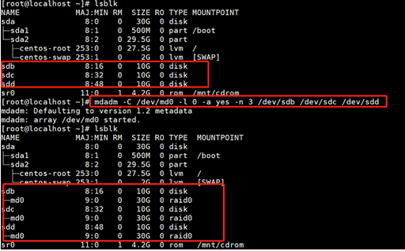

首先用lsblk查看磁盘信息

用mdadm工具做raid 0
mdadm -C /dev/md0 -a yes -l 0 -n 3 /dev/sdb /dev/sdc /dev/sdd  

用mkfs工具将raid设备格式化为xfs文件系统
mkfs.xfs -f /dev/md0

创建目录
# mkdir -p /data1
手动mount挂载
# mount /dev/md0 /data1
设置开机自动挂载
给/etc/rc.d/rc.local 文件加上x权限，添加下面内容
# chmod +x /etc/rc.d/rc.local
/sbin/mdadm -A /dev/md0 /dev/sdb /dev/sdc /dev/sdd
sleep 5
/bin/mount -t xfs /dev/md0 /data1 -o noatime,nodiratime,nobarrier,largeio,inode64,swalloc,sunit=1024,swidth=4096

